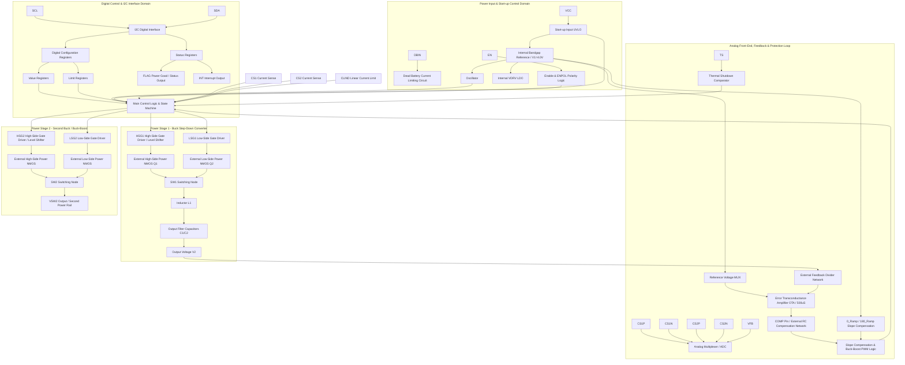
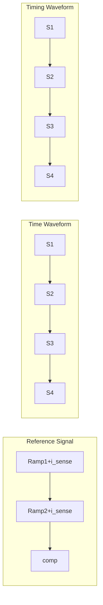
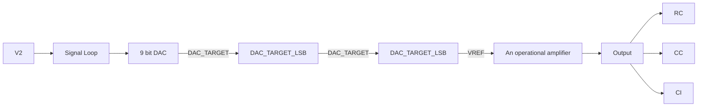
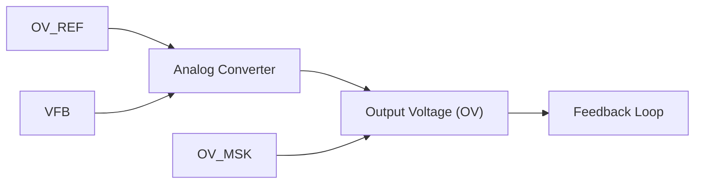
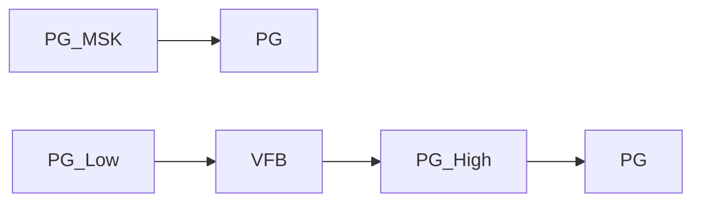
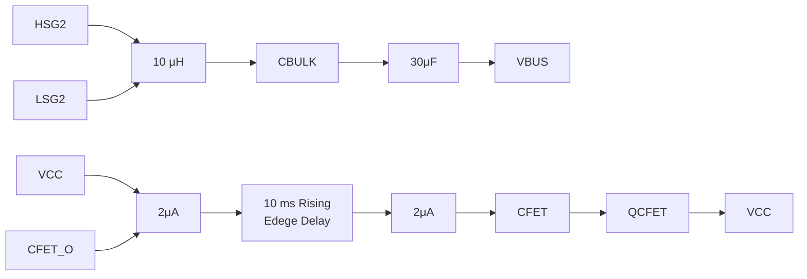

# NCP81239, NCP81239A USB Power Delivery 4-Switch Buck Boost Controller

The NCP81239 USB Power Delivery (PD) Controller is a synchronous buck boost that is optimized for converting battery voltage or adaptor voltage into power supply rails required in notebook, tablet, and desktop systems, as well as many other consumer devices using USB PD standard and C−Type cables. The NCP81239 is fully compliant to the USB Power Delivery Specification when used in conjunction with a USB PD or C−Type Interface Controller. NCP81239 is designed for applications requiring dynamically controlled slew rate limited output voltage that require either voltage higher or lower than the input voltage. The NCP81239 drives 4 NMOSFET switches, allowing it to buck or boost and support the functions specified in the USB Power Delivery Specification which is suitable for all USB PD applications. The USB PD Buck Boost Controller operates with a supply and load range of 4.5 V to 32 V. NCP81239A is functionally same as NCP81239 except with different I<sup>2</sup>C address.

## Features

• Wide Input Voltage Range: from 4.5 V to 32 V  
• Dynamically Programmed Frequency from 150 kHz to 1.2 MHz  
• I<sup>2</sup>C Interface  
• Real Time Power Good Indication  
• Controlled Slew Rate Voltage Transitioning  
• Feedback Pin with Internally Programmed Reference  
• Support USBPD/QC2.0/QC3.0 Profile  
• 2 Independent Current Sensing Inputs  
• Over Temperature Protection  
• Adaptive Non−Overlap Gate Drivers  
• Filter Capacitor Switch Control  
• Over−Voltage and Over−Current Protection  
• Dead Battery Power Support  
• 5 x 5 mm QFN32 Package

## Typical Applications

• Notebooks, Tablets, Desktops  
• All in Ones  
• Monitors, TV s, and Set Top Boxes  
• Consumer Electronics  
• Car Chargers  
• Docking Stations  
• Power Banks


QFN32 5x5, 0.5P

CASE 485CE

MARKING DIAGRAM  


<details>
<summary>text_image</summary>

1
NCP81239
AWLYYWW■
■
1
81239A
AWLYYWW■
■
</details>

A = Assembly Location  
WL = Wafer Lot  
YY = Year  
WW = Work Week  
= Pb−Free Package

(Note: Microdot may be in either location)

ORDERING INFORMATION

<table><tr><td>Device</td><td>Package</td><td>Shipping†</td></tr><tr><td>NCP81239MNTXG</td><td>QFN32 (Pb-Free)</td><td>2500 / Tape &amp; Reel</td></tr><tr><td>NCP81239AMNTXG</td><td>QFN32 (Pb-Free)</td><td>2500 / Tape &amp; Reel</td></tr></table>

†For information on tape and reel specifications, including part orientation and tape sizes, please refer to our Tape and Reel Packaging Specifications Brochure, BRD8011/D.


<details>
<summary>flowchart</summary>

This diagram illustrates the signal flow and control logic of a power management system, showing connections between components like a 5V Rail, DBIN, VDRV, and various sensors like CS1, CS2, and I2C.
</details>

Figure 1. Typical Application Circuit


<details>
<summary>text_image</summary>

BST1 VSW1 VCC VDRV DBIN DBOUT VSW2 BST2
32 31 30 29 28 27 26 25
HSG1 1 24 HSG2
LSG1 2 23 LSG2
PGND1 3 22 PGND2
CSN1 4 21 CSP2
CSP1 5 20 CSN2
V1 6 19 FB
CS1 7 18 CS2
CLIND 8 17 PDRV
9 10 11 12 13 14 15 16
SDA SCL INT CFET AGND AGND COMP EN
</details>

Figure 2. Pinout


<details>
<summary>flowchart</summary>


</details>

Figure 3. Block Diagram

Table 1. PIN FUNCTION DESCRIPTION

<table><tr><td>Pin</td><td>Pin Name</td><td>Description</td></tr><tr><td>1</td><td>HSG1</td><td>S1 gate drive. Drives the S1 N-channel MOSFET with a voltage equal to VDRV superimposed on the switch node voltage VSW1.</td></tr><tr><td>2</td><td>LSG1</td><td>Drives the gate of the S2 N-channel MOSFET between ground and VDRV.</td></tr><tr><td>3, 22</td><td>PGND</td><td>Power ground for the low side MOSFET drivers. Connect these pins closely to the source of the bottom N-channel MOSFETs.</td></tr><tr><td>4</td><td>CSN1</td><td>Negative terminal of the current sense amplifier.</td></tr><tr><td>5</td><td>CSP1</td><td>Positive terminal of the current sense amplifier.</td></tr><tr><td>6</td><td>V1</td><td>Input voltage of the converter</td></tr><tr><td>7</td><td>CS1</td><td>Current sense amplifier output. CS1 will source a current that is proportional to the voltage across RS1 to an external resistor. CS1 voltage can be monitored with a high impedance input. Ground this pin if not used.</td></tr><tr><td>8</td><td>CLIND</td><td>Open drain output to indicate that the CS1 or CS2 voltage has exceeded the I2C programmed limit.</td></tr><tr><td>9</td><td>SDA</td><td>I2C interface data line.</td></tr><tr><td>10</td><td>SCL</td><td>I2C interface clock line.</td></tr><tr><td>11</td><td>INT</td><td>Interrupt is an open drain output that indicates the state of the output power, the internal thermal trip, and other I2C programmable functions.</td></tr><tr><td>12</td><td>CFET</td><td>Controlled drive of an external MOSFET that connects a bulk output capacitor to the output of the power converter. Necessary to adhere to low capacitance limits of the standard USB Specifications for power prior to USB PD negotiation.</td></tr><tr><td>13–14</td><td>AGND</td><td>The ground pin for the analog circuitry.</td></tr><tr><td>15</td><td>COMP</td><td>Output of the transconductance amplifier used for stability in closed loop operation.</td></tr></table>

Table 1. PIN FUNCTION DESCRIPTION

<table><tr><td>Pin</td><td>Pin Name</td><td>Description</td></tr><tr><td>16</td><td>EN</td><td>Precision enable starts the part and places it into default configuration when toggled.</td></tr><tr><td>17</td><td>PDRV</td><td>The open drain output used to control a PMOSFET.</td></tr><tr><td>18</td><td>CS2</td><td>Current sense amplifier output. CS2 will source a current that is proportional to the voltage across RS2 to an external resistor. CS2 voltage can be monitored with a high impedance input. Ground this pin if not used.</td></tr><tr><td>19</td><td>FB</td><td>Feedback voltage of the output, negative terminal of the gm amplifier.</td></tr><tr><td>20</td><td>CSN2</td><td>Negative terminal of the current sense amplifier.</td></tr><tr><td>21</td><td>CSP2</td><td>Positive terminal of the current sense amplifier.</td></tr><tr><td>23</td><td>LSG2</td><td>Drives the gate of the S3 N-channel MOSFET between ground and VDRV.</td></tr><tr><td>24</td><td>HSG2</td><td>S4 gate drive. Drives the S4 N-channel MOSFET with a voltage equal to VDRV superimposed on the switch node voltage VSW2.</td></tr><tr><td>25</td><td>BST2</td><td>Bootstrapped Driver Supply. The BST2 pin swings from a diode voltage below VDRV up to a diode voltage below VOUT + VDRV. Place a 0.1 μF capacitor from this pin to VSW2.</td></tr><tr><td>26</td><td>VSW2</td><td>Switch Node. VSW2 pin swings from a diode voltage drop below ground up to output voltage.</td></tr><tr><td>27</td><td>DBOUT</td><td>The output of the dead battery circuit which can also be used for the VCONN voltage supply.</td></tr><tr><td>28</td><td>DBIN</td><td>The dead battery input to the converter where 5 V is applied. A 1 μF capacitor should be placed close to the part to decouple this line.</td></tr><tr><td>29</td><td>VDRV</td><td>Internal voltage supply to the driver circuits. A 1 μF capacitor should be placed close to the part to decouple this line.</td></tr><tr><td>30</td><td>VCC</td><td>The VCC pin supplies power to the internal circuitry. The VCC is the output of a linear regulator which is powered from V1. Pin should be decoupled with a 1 μF capacitor for stable operation.</td></tr><tr><td>31</td><td>VSW1</td><td>Switch Node. VSW1 pin swings from a diode voltage drop below ground up to V1.</td></tr><tr><td>32</td><td>BST1</td><td>Driver Supply. The BST1 pin swings from a diode voltage below VDRV up to a diode voltage below V1 + VDRV. Place a 0.1 μF capacitor from this pin to VSW1.</td></tr><tr><td>33</td><td>THPAD</td><td>Center Thermal Pad. Connect to AGND externally.</td></tr></table>

Table 2. MAXIMUM RATINGS Over operating free−air temperature range unless otherwise noted

<table><tr><td>Rating</td><td>Symbol</td><td>Min</td><td>Max</td><td>Unit</td></tr><tr><td>Input of the Dead Battery Circuit</td><td>DBIN</td><td>-0.3</td><td>5.5</td><td>V</td></tr><tr><td>Output of the Dead Battery Circuit</td><td>DBOUT</td><td>-0.3</td><td>5.5</td><td>V</td></tr><tr><td>Driver Input Voltage</td><td>VDRV</td><td>-0.3</td><td>5.5</td><td>V</td></tr><tr><td>Internal Regulator Output</td><td>VCC</td><td>-0.3</td><td>5.5</td><td>V</td></tr><tr><td>Output of Current Sense Amplifiers</td><td>CS1, CS2</td><td>-0.3</td><td>3.0</td><td>V</td></tr><tr><td>Current Limit Indicator</td><td>CLIND</td><td>-0.3</td><td>VCC + 0.3</td><td>V</td></tr><tr><td>Interrupt Indicator</td><td>INT</td><td>-0.3</td><td>VCC + 0.3</td><td>V</td></tr><tr><td>Enable Input</td><td>EN</td><td>-0.3</td><td>5.5</td><td>V</td></tr><tr><td>I2C Communication Lines</td><td>SDA, SCL</td><td>-0.3</td><td>VCC + 0.3</td><td>V</td></tr><tr><td>Compensation Output</td><td>COMP</td><td>-0.3</td><td>VCC + 0.3</td><td>V</td></tr><tr><td>V1 Power Stage Input Voltage</td><td>V1</td><td>-0.3</td><td>32 V, 40 V (20 ns)</td><td>V</td></tr><tr><td>Positive Current Sense</td><td>CSP1</td><td>-0.3</td><td>32 V, 40 V (20 ns)</td><td>V</td></tr><tr><td>Negative Current Sense</td><td>CSN1</td><td>-0.3</td><td>32 V, 40 V (20 ns)</td><td>V</td></tr><tr><td>Positive Current Sense</td><td>CSP2</td><td>-0.3</td><td>32 V, 40 V (20 ns)</td><td>V</td></tr><tr><td>Negative Current Sense</td><td>CSN2</td><td>-0.3</td><td>32 V, 40 V (20 ns)</td><td>V</td></tr><tr><td>Feedback Voltage</td><td>FB</td><td>-0.3</td><td>5.5</td><td>V</td></tr><tr><td>CFET Driver</td><td>CFET</td><td>-0.3</td><td>VCC + 0.3</td><td>V</td></tr></table>

Table 2. MAXIMUM RATINGS Over operating free−air temperature range unless otherwise noted

<table><tr><td>Rating</td><td>Symbol</td><td>Min</td><td>Max</td><td>Unit</td></tr><tr><td>Driver 1 and Driver 2 Positive Rails</td><td>BST1, BST2</td><td>-0.3 V wrt/PGND -0.3 V wrt/VSW</td><td>37 V, 40 V (20 ns) wrt/PGND 5.5 V wrt/VSW</td><td>V</td></tr><tr><td>High Side Driver 1 and Driver 2</td><td>HSG1, HSG2</td><td>-0.3 V wrt/PGND -0.3 V wrt/VSW</td><td>37 V, 40 V (20 ns) wrt/GND 5.5 V wrt/VSW</td><td>V</td></tr><tr><td>Switching Nodes and Return Path of Driver 1 and Driver 2</td><td>VSW1, VSW2</td><td>-5.0 V</td><td>32 V, 40 V (20 ns)</td><td>V</td></tr><tr><td>Low Side Driver 1 and Driver 2</td><td>LSG1, LSG2</td><td>-0.3 V</td><td>5.5</td><td>V</td></tr><tr><td>PMOSFET Driver</td><td>PDRV</td><td>-0.3</td><td>32 V, 40 V (20 ns)</td><td>V</td></tr><tr><td>Voltage Differential</td><td>AGND to PGND</td><td>-0.3</td><td>0.3</td><td>V</td></tr><tr><td>CSP1-CSN1, CSP2-CSN2 Differential Voltage</td><td>CS1DIF, CS2DIF</td><td>-0.5</td><td>0.5</td><td>V</td></tr><tr><td>PDRV Maximum Current</td><td>PDRVI</td><td>0</td><td>10</td><td>mA</td></tr><tr><td>PDRV Maximum Pulse Current (100 ms on time, with &gt;1 s interval)</td><td>PDRVIPUL</td><td>0</td><td>200</td><td>mA</td></tr><tr><td>Maximum VCC Current</td><td>VCCI</td><td>0</td><td>80</td><td>mA</td></tr><tr><td>Operating Junction Temperature Range (Note 1)</td><td>TJ</td><td>-40</td><td>150</td><td>°C</td></tr><tr><td>Operating Ambient Temperature Range</td><td>TA</td><td>-40</td><td>100</td><td>°C</td></tr><tr><td>Storage Temperature Range</td><td>TSTG</td><td>-55</td><td>150</td><td>°C</td></tr><tr><td>Thermal Characteristics (Note 2) QFN 32 5mm x 5mm</td><td></td><td></td><td></td><td></td></tr><tr><td>Maximum Power Dissipation @ TA = 25°C</td><td>PD</td><td colspan="2">4.1</td><td>W</td></tr><tr><td>Maximum Power Dissipation @ TA = 85°C</td><td>PD</td><td colspan="2">2.1</td><td>W</td></tr><tr><td>Thermal Resistance Junction-to-Air with Solder</td><td>RΘJA</td><td colspan="2">30</td><td>°C/W</td></tr><tr><td>Thermal Resistance Junction-to-Case Top with Solder</td><td>RΘJCT</td><td colspan="2">1.7</td><td>°C/W</td></tr><tr><td>Thermal Resistance Junction-to-Case Bottom with Solder</td><td>RΘJCB</td><td colspan="2">2.0</td><td>°C/W</td></tr><tr><td>Lead Temperature Soldering (10 sec): Reflow (SMD styles only) Pb-Free (Note 3)</td><td>RF</td><td colspan="2">260 Peak</td><td>°C</td></tr></table>

Stresses exceeding those listed in the Maximum Ratings table may damage the device. If any of these limits are exceeded, device functionality should not be assumed, damage may occur and reliability may be affected.  
1. The maximum package power dissipation limit must not be exceeded.  
2. The value of θJA is measured with the device mounted on a 3in x 3in, 4 layer, 0.062 inch FR−4 board with 1.5 oz. copper on the top and bottom layers and 0.5 ounce copper on the inner layers, in a still air environment with TA = 25°C.  
3. 60−180 seconds minimum above 237°C.

Table 3. RECOMMENDED OPERATION RATINGS

<table><tr><td rowspan="2">Rating</td><td rowspan="2">Symbol</td><td colspan="2">Value</td><td rowspan="2">Units</td></tr><tr><td>Min</td><td>Max</td></tr><tr><td>Driver Input Voltage</td><td>VDRV</td><td>4.5</td><td>5.5</td><td>V</td></tr><tr><td>Internal Regulator Output</td><td>VCC</td><td>4.5</td><td>5.5</td><td>V</td></tr><tr><td>Current Limit Indicator</td><td>CLIND</td><td>-0.3</td><td>VCC+0.3</td><td>V</td></tr><tr><td>Interrupt Indicator</td><td>INT</td><td>-0.3</td><td>VCC+0.3</td><td>V</td></tr><tr><td>Enable Input</td><td>EN</td><td>-0.3</td><td>5.5</td><td>V</td></tr><tr><td>I2C Communication Lines</td><td>SDA, SCL</td><td>-0.3</td><td>VCC+0.3</td><td>V</td></tr><tr><td>Compensation Output</td><td>COMP</td><td>-0.3</td><td>VCC+0.3</td><td>V</td></tr><tr><td>Power Stage Input Voltage to PGND</td><td>V1</td><td>4.5</td><td>28</td><td>V</td></tr><tr><td>Input Side Current Sense Pins</td><td>CSP1, CSN1</td><td>-0.3</td><td>28</td><td>V</td></tr><tr><td>Output Side Current Sense Pins</td><td>CSP2, CSN2</td><td>-0.3</td><td>28</td><td>V</td></tr><tr><td>Driver Positive Rails to PGND</td><td>BST1, BST2</td><td>-0.3</td><td>33</td><td>V</td></tr><tr><td>High Side Driver 1 and 2</td><td>HSG1, HSG2</td><td>-0.3</td><td>33</td><td>V</td></tr><tr><td>Switching Nodes and Return Path of Driver 1 and 2 to PGND</td><td>VSW1, VSW2</td><td>-2</td><td>28</td><td>V</td></tr><tr><td>Low Side Driver 1 and 2</td><td>LSG1, LSG2</td><td>-0.3</td><td>5.5</td><td>V</td></tr><tr><td>FB Voltage</td><td>FB</td><td>-0.3</td><td>5.5</td><td>V</td></tr><tr><td>Voltage Differential</td><td>AGND to PGND</td><td>-0.3</td><td>0.3</td><td>V</td></tr><tr><td>CSP1-CSN1, CSP2-CSN2 Differential Voltage</td><td>CS1DF, CS2DF</td><td>-0.5</td><td>0.5</td><td>V</td></tr><tr><td>Operating Junction Temperature Range</td><td>TJ</td><td>-40</td><td>150</td><td>°C</td></tr><tr><td>Operating Ambient Temperature Range</td><td>TA</td><td>-40</td><td>100</td><td>°C</td></tr></table>

Functional operation above the stresses listed in the Recommended Operating Ranges is not implied. Extended exposure to stresses beyond the Recommended Operating Ranges limits may affect device reliability.

Table 4. ELECTRICAL CHARACTERISTICS  
(V1 = 12 V, $\mathsf { V } _ { \mathsf { o u t } } = 1 . 0 \mathsf { V }$ , T<sub>A</sub> = +25°C for typical value; −40°C < $\mathsf { T } _ { \mathsf { A } } <$ < 100°C for min/max values unless noted otherwise)

<table><tr><td>Parameter</td><td>Symbol</td><td>Test Conditions</td><td>Min</td><td>Typ</td><td>Max</td><td>Units</td></tr><tr><td colspan="7">POWER SUPPLY</td></tr><tr><td>V1 Operating Input Voltage</td><td>V1</td><td></td><td>4.5</td><td></td><td>32</td><td>V</td></tr><tr><td>VDRV Operating Input Voltage</td><td>VDRV</td><td></td><td>4.5</td><td>5</td><td>5.5</td><td>V</td></tr><tr><td>VCC UVLO Rising Threshold</td><td> $VCC_{START}$ </td><td></td><td></td><td>4.3</td><td></td><td>V</td></tr><tr><td>UVLO Hysteresis for VCC</td><td> $VCCV_{HYS}$ </td><td>Falling Hysteresis</td><td></td><td>300</td><td></td><td>mV</td></tr><tr><td>VDRV UVLO Rising Threshold</td><td> $VDRV_{START}$ </td><td></td><td></td><td>4.3</td><td></td><td>V</td></tr><tr><td>UVLO Hysteresis for VDRV</td><td> $VDRV_{HYS}$ </td><td>Falling Hysteresis</td><td></td><td>300</td><td></td><td>mV</td></tr><tr><td>VCC Output Voltage</td><td>VCC</td><td>With no external load</td><td>4.5</td><td>5</td><td></td><td>V</td></tr><tr><td>VCC Drop Out Voltage</td><td> $VCCDROOP$ </td><td>30 mA load</td><td></td><td>150</td><td></td><td>mV</td></tr><tr><td>VCC Output Current Limit</td><td> $IOUT_{VCC}$ </td><td>VCC Loaded to 4.3 V</td><td>80</td><td>97</td><td></td><td>mA</td></tr><tr><td>V1 Shutdown Supply Current</td><td> $IVCC\_SD$ </td><td>EN = 0 V, 4.3 V ≤ V1 ≤ 28 V</td><td></td><td>6.6</td><td>7.7</td><td>mA</td></tr><tr><td>VDRIVE Switching Current Buck</td><td> $IV1\_SW$ </td><td>EN = 5 V, Cgate = 2.2 nF,VSW = 0 V, FSW = 600 kHz</td><td></td><td>15</td><td></td><td>mA</td></tr><tr><td>VDRIVE Switching Current Boost</td><td> $IV1\_SW$ </td><td>EN = 5 V, Cgate = 2.2 nF,VSW = 0 V, FSW = 600 kHz</td><td></td><td>15</td><td></td><td>mA</td></tr></table>

4. Ensured by design. Not production tested.

Table 4. ELECTRICAL CHARACTERISTICS  
(V1 = 12 V, $\mathsf { V } _ { \mathsf { o u t } } = 1 . 0 \mathsf { V }$ , T<sub>A</sub> = +25°C for typical value; −40°C < $\mathsf { T } _ { \mathsf { A } } <$ 100°C for min/max values unless noted otherwise)

<table><tr><td>Parameter</td><td>Symbol</td><td>Test Conditions</td><td>Min</td><td>Typ</td><td>Max</td><td>Units</td></tr></table>

VOLTAGE OUTPUT

<table><tr><td rowspan="3">Voltage Output Accuracy</td><td rowspan="3">FB</td><td>DAC_TARGET = 00110010</td><td>0.495</td><td>0.5</td><td>0.505</td><td>V</td></tr><tr><td>DAC_TARGET = 01111000</td><td>1.188</td><td>1.2</td><td>1.212</td><td></td></tr><tr><td>DAC_TARGET = 11001000</td><td>1.98</td><td>2.0</td><td>2.02</td><td></td></tr><tr><td rowspan="4">Voltage Accuracy Over Temperature</td><td rowspan="2">VFB_T</td><td>VFB ≥ 0.5 V</td><td>-1.0</td><td></td><td>1.0</td><td>%</td></tr><tr><td>VFB &lt; 0.5 V</td><td>-5</td><td></td><td>5</td><td>mV</td></tr><tr><td rowspan="2">VFB_R</td><td>TA = 25°C</td><td></td><td></td><td></td><td>%</td></tr><tr><td>VFB ≥ 0.5 V</td><td>-0.45</td><td></td><td>0.45</td><td></td></tr></table>

TRANSCONDUCTANCE AMPLIFIER

<table><tr><td>Gain Bandwidth Product</td><td>GBW</td><td>(Note 4)</td><td></td><td>5.2</td><td></td><td>MHz</td></tr><tr><td>Transconductance</td><td>GM1</td><td>Default</td><td></td><td>500</td><td></td><td>μS</td></tr><tr><td>Max Output Source Current limit</td><td>GMSOC</td><td></td><td>60</td><td>80</td><td></td><td>μA</td></tr><tr><td>Max Output Sink Current limit</td><td>GMSIC</td><td></td><td>60</td><td>80</td><td></td><td>μA</td></tr><tr><td>Voltage Ramp</td><td>Vramp</td><td></td><td></td><td>1.4</td><td></td><td>V</td></tr></table>

INTERNAL BST DIODE

<table><tr><td>Forward Voltage Drop</td><td>VFBOT</td><td>IF=10 mA, TA=25°C</td><td>0.35</td><td>0.46</td><td>0.55</td><td>V</td></tr><tr><td>Reverse Bias Leakage Current</td><td>DIL</td><td>BST-VSW=5 VVSW=28 V, TA=25°C</td><td></td><td>0.05</td><td>1</td><td>μA</td></tr><tr><td>BST-VSW UVLO</td><td>BST1_UVLO</td><td>Rising, Note 4</td><td></td><td>3.5</td><td></td><td>V</td></tr><tr><td>BST-VSW Hysteresis</td><td>BST_HYS</td><td>Note 4</td><td></td><td>300</td><td></td><td>mV</td></tr></table>

OSCILLATOR

<table><tr><td rowspan="3">Oscillator Frequency</td><td>FSW_0</td><td>FSW = 000, default</td><td>528</td><td>600</td><td>672</td><td>kHz</td></tr><tr><td>FSW_1</td><td>FSW = 001</td><td>132</td><td>150</td><td>168</td><td>kHz</td></tr><tr><td>FSW_7</td><td>FSW = 110</td><td>1056</td><td>1200</td><td>1344</td><td>kHz</td></tr><tr><td>Oscillator Frequency Accuracy</td><td>FSWE</td><td></td><td>-12</td><td></td><td>12</td><td>%</td></tr><tr><td>Minimum On Time</td><td>MOT</td><td>Measured at 10% to 90% of VCC</td><td></td><td>50</td><td></td><td>ns</td></tr><tr><td>Minimum Off Time</td><td>MOFT</td><td>Measured at 90% to 10% of VCC</td><td></td><td>90</td><td></td><td>ns</td></tr></table>

INT THRESHOLDS

<table><tr><td>Interrupt Low Voltage</td><td>VINTI</td><td>IINT(sink) = 2 mA</td><td></td><td></td><td>0.2</td><td>V</td></tr><tr><td>Interrupt High Leakage Current</td><td>INII</td><td>3.3 V</td><td></td><td>3</td><td>100</td><td>nA</td></tr><tr><td>Interrupt Startup Delay</td><td>INTPG</td><td>Soft Start end to PG positive edge</td><td></td><td>2.1</td><td></td><td>ms</td></tr><tr><td rowspan="2">Interrupt Propagation Delay</td><td>PGI</td><td>Delay for power good in</td><td></td><td>3.3</td><td></td><td>ms</td></tr><tr><td>PGO</td><td>Delay for power good out</td><td></td><td>100</td><td></td><td>ns</td></tr><tr><td rowspan="3">Power Good Threshold</td><td>PGTH</td><td>Power Good in from high</td><td></td><td>105</td><td></td><td>%</td></tr><tr><td>PGTH</td><td>Power Good in from low</td><td></td><td>95</td><td></td><td>%</td></tr><tr><td>PGTHYS</td><td>PG falling hysteresis</td><td></td><td>2.5</td><td></td><td>%</td></tr><tr><td>FB Overvoltage Threshold</td><td>FB_OV</td><td></td><td></td><td>120</td><td></td><td>%</td></tr><tr><td>Overvoltage Propagation Delay</td><td>VFB_OVDL</td><td></td><td></td><td>1 Cycle</td><td></td><td></td></tr></table>

EXTERNAL CURRENT SENSE (CS1,CS2)

<table><tr><td>Positive Current Measurement High</td><td>CS10</td><td>CSP1-CSN1 or CSP2-CSN2 = 100 mV</td><td></td><td>500</td><td></td><td>μA</td></tr></table>

4. Ensured by design. Not production tested.

Table 4. ELECTRICAL CHARACTERISTICS  
(V1 = 12 V, $\mathsf { V } _ { \mathsf { o u t } } = 1 . 0 \mathsf { V }$ , T<sub>A</sub> = +25°C for typical value; −40°C < $\mathsf { T } _ { \mathsf { A } } <$ 100°C for min/max values unless noted otherwise)

<table><tr><td>Parameter</td><td>Symbol</td><td>Test Conditions</td><td>Min</td><td>Typ</td><td>Max</td><td>Units</td></tr></table>

EXTERNAL CURRENT SENSE (CS1,CS2)

<table><tr><td>Transconductance Gain Factor</td><td>CSGT</td><td>Current Sense Transconductance Vsense = 1 mV to 100 mV</td><td></td><td>5</td><td></td><td>mS</td></tr><tr><td>Transconductance Deviation</td><td>CSGE</td><td></td><td>-20</td><td></td><td>20</td><td>%</td></tr><tr><td>Current Sense Common Mode Range</td><td>CSCMMR</td><td></td><td>3</td><td></td><td>32</td><td>V</td></tr><tr><td>-3 dB Small Signal Bandwidth</td><td>CSBW</td><td>VSENSE (AC) = 10 mVPP, RGAIN = 10 kΩ (Note 4)</td><td></td><td>30</td><td></td><td>MHz</td></tr><tr><td>Input Sense Voltage Full Scale</td><td>ISVFS</td><td></td><td></td><td></td><td>100</td><td>mV</td></tr><tr><td>CS Output Voltage Range</td><td>CSOR</td><td>VSENSE = 100 mV Rset = 6k</td><td>0</td><td></td><td>3</td><td>V</td></tr></table>

EXTERNAL CURRENT LIMIT (CLIND)

<table><tr><td>Current Limit Indicator Output Low</td><td>CLINDL</td><td>Input current = 500 μA</td><td></td><td>5.6</td><td>100</td><td>mV</td></tr><tr><td>Current Limit Indicator Output High Leakage Current</td><td>ICLINDH</td><td>Pull up to 5 V</td><td></td><td>500</td><td></td><td>μA</td></tr></table>

INTERNAL CURRENT SENSE

<table><tr><td>Internal Current Sense Gain for PWM</td><td>ICG</td><td>CSPx-CSNx = 100 mV</td><td>9.2</td><td>9.8</td><td>10.5</td><td>V/V</td></tr><tr><td>Positive Peak Current Limit Trip</td><td>PPCLT</td><td>INT_CL = 00</td><td>34</td><td>39</td><td>44</td><td>mV</td></tr><tr><td>Negative Valley Current Limit Trip</td><td>NVCLT</td><td>INT_CL_NEG = 00</td><td>31</td><td>40</td><td>45</td><td>mV</td></tr></table>

SWITCHING MOSFET DRIVERS

<table><tr><td>HSG1 HSG2 Pullup Resistance</td><td>HSG_PU</td><td>BST-VSW = 4.5 V</td><td></td><td>2.8</td><td></td><td>Ω</td></tr><tr><td>HSG1 HSG2 Pulldown Resistance</td><td>HSG_PD</td><td>BST-VSW = 4.5 V</td><td></td><td>1.2</td><td></td><td>Ω</td></tr><tr><td>LSG1 LSG2 Pullup Resistance</td><td>LSG_PU</td><td>LSG -PGND = 2.5 V</td><td></td><td>3.3</td><td></td><td>Ω</td></tr><tr><td>LSG1 LSG2 Pulldown Resistance</td><td>LSG_PD</td><td>LSG -PGND = 2.5 V</td><td></td><td>0.9</td><td></td><td>Ω</td></tr><tr><td>HSG Falling to LSG Rising Delay</td><td>HSLSD</td><td></td><td></td><td>15</td><td></td><td>ns</td></tr><tr><td>LSG Falling to HSG Rising Delay</td><td>LSHSD</td><td></td><td></td><td>15</td><td></td><td>ns</td></tr></table>

CFET

<table><tr><td>CFET Drive Voltage</td><td>CFETDV</td><td></td><td></td><td>VCC</td><td></td><td>V</td></tr><tr><td>Source/Sink Current</td><td>CFETSS</td><td>CFET clamped to 2 V</td><td></td><td>2</td><td></td><td>μA</td></tr><tr><td>Pull Down Delay</td><td>CFETD</td><td>Measured at 10% to 90% of VCC</td><td></td><td>10</td><td></td><td>ms</td></tr><tr><td>CFET Pull Down Resistance</td><td>CFETR</td><td>Measured with 1 mA Pull up Current, after 10ms rising edge delay</td><td></td><td>1.3</td><td></td><td>kΩ</td></tr></table>

SLEW RATE/SOFT START

<table><tr><td>Charge Slew Rate</td><td>SLEWP</td><td>Slew = 00, FB = 0.1 VOUTSlew = 11, FB = 0.1 VOUT</td><td></td><td>0.64.8</td><td></td><td>mV/μs</td></tr><tr><td>Discharge Slew Rate</td><td>SLEWN</td><td>Slew = 00, FB = 0.1 VOUTSlew = 11, FB = 0.1 VOUT</td><td></td><td>-0.6-4.8</td><td></td><td>mV/μs</td></tr><tr><td>Prebias Level</td><td>PBLV</td><td>FB=0.1VOUT</td><td></td><td>300</td><td></td><td>mV</td></tr></table>

DEAD BATTERY/VCONN

<table><tr><td>Dead Battery Input Voltage Range</td><td>VDB</td><td></td><td>4.5</td><td>5</td><td>5.25</td><td>V</td></tr><tr><td>Dead Battery Output Voltage</td><td>VIO</td><td>VDB = 5 V, Output Current 32 mA</td><td>4</td><td>4.7</td><td>5</td><td>V</td></tr><tr><td>Dead Battery Current Limit</td><td>DB_LIM</td><td>VDB = 5 V, DBOUT greater than 2 V</td><td>29</td><td>57</td><td></td><td>mA</td></tr></table>

4. Ensured by design. Not production tested.

Table 4. ELECTRICAL CHARACTERISTICS  
(V1 = 12 V, $\mathsf { V } _ { \mathsf { o u t } } = 1 . 0 \mathsf { V }$ , T<sub>A</sub> = +25°C for typical value; −40°C < $\mathsf { T } _ { \mathsf { A } } <$ 100°C for min/max values unless noted otherwise)

<table><tr><td>Parameter</td><td>Symbol</td><td>Test Conditions</td><td>Min</td><td>Typ</td><td>Max</td><td>Units</td></tr></table>

ENABLE

<table><tr><td>EN High Threshold Voltage</td><td>ENHT</td><td>EN_MASK = ENPU = ENPOL = 0</td><td></td><td>798</td><td>820</td><td>mV</td></tr><tr><td>EN Low Threshold Voltage</td><td>ENLT</td><td></td><td>640</td><td>665</td><td></td><td>mV</td></tr><tr><td>EN Pull Up Current</td><td>IEN_UP</td><td>EN = 0 V</td><td></td><td>5</td><td></td><td>μA</td></tr><tr><td>EN Pull Down Current</td><td>IEN_DN</td><td>EN = VCC</td><td></td><td>5</td><td></td><td>μA</td></tr></table>

I<sup>2</sup>C INTERFACE

<table><tr><td>Voltage Threshold</td><td>I2CVTH</td><td></td><td>0.95</td><td>1</td><td>1.05</td><td>V</td></tr><tr><td>Propagation Delay</td><td>I2CPD</td><td>(Note 4)</td><td></td><td>25</td><td></td><td>ns</td></tr><tr><td>Communication Speed</td><td>I2CSP</td><td></td><td></td><td></td><td>1</td><td>MHz</td></tr></table>

THERMAL SHUTDOWN

<table><tr><td>Thermal Shutdown Threshold</td><td>TSD</td><td>(Note 4)</td><td></td><td>151</td><td></td><td>°C</td></tr><tr><td>Thermal Shutdown Hysteresis</td><td>TSDHYS</td><td>(Note 4)</td><td></td><td>28</td><td></td><td>°C</td></tr></table>

PDRV

<table><tr><td>PDRV Operating Range</td><td></td><td></td><td>0</td><td></td><td>28</td><td>V</td></tr><tr><td>PDRV Leakage Current</td><td>PDRV_IDS</td><td>FET OFF, VPDRV = 28 V</td><td></td><td>180</td><td></td><td>nA</td></tr><tr><td>PDRV Saturation Voltage</td><td>PDRV_VDS</td><td>ISNK = 10 mA</td><td></td><td>0.20</td><td></td><td>V</td></tr></table>

INTERNAL ADC

<table><tr><td>Range</td><td>ADCRN</td><td>(Note 4)</td><td>0</td><td></td><td>2.55</td><td>V</td></tr><tr><td>LSB Value</td><td>ADCLSB</td><td>(Note 4)</td><td></td><td>20</td><td></td><td>mV</td></tr><tr><td>Error</td><td>ADCFE</td><td>(Note 4)</td><td></td><td>1</td><td></td><td>LSB</td></tr></table>

4. Ensured by design. Not production tested.

Product parametric performance is indicated in the Electrical Characteristics for the listed test conditions, unless otherwise noted. Product performance may not be indicated by the Electrical Characteristics if operated under different conditions.

# NCP81239, NCP81239A

## APPLICATION INFORMATION

## Dual Edge Current Mode Control

When dual edge current mode control is used, two voltage ramps are generated that are 180 degrees out of phase. The inductor current signal is added to the ramps to incorporate current mode control. In Figure 4, the COMP signal from the compensation output interacts with two triangle ramps to generate gate signals to the switches from S1 to S4. Two ramp signals cross twice at midpoint within a cycle. When COMP is above the midpoint, the system will operate at boost mode with S1 always on and S2 always off, but S3 and S4 turning on alternatively in an active switching mode. When COMP is below the midpoint, the system will operation at buck mode, with S4 always on and S3 always off, but S1 and S2 turning on alternatively in an active switching mode. The controller can switch between buck and boost mode smoothly based on the COMP signal from peak current regulation.


<details>
<summary>flowchart</summary>


</details>


<details>
<summary>text_image</summary>

V1 S1 L1 S4 V2
S2 S3
</details>

Figure 4. Transitions for Dual Edge 4 Switch Buck Boost

## Feedback and Output Voltage Profile

The feedback of the converter output voltage is connected to the FB pin of the device through a resistor divider. Internally FB is connected to the inverting input of the internal transconductance error amplifier. The non−inverting input of the gm amplifier is connected to the internal reference. The internal reference voltage is by default 0.5 V. Therefore a 10:1 resistor divider from the converter output to the FB will set the output voltage to 5 V in default. The reference voltage can be adjusted with 10 mV(default) or 5 mV steps from 0.1 V to 2.55 V through the voltage profile register (01H), which makes the continuous output voltage profile possible through an external resistor divider. For example, by default, if the external resistor divider has a 10:1 ratio, the output voltage profile will be able to vary from 1 V to 25.5 V with 100 mV steps.

It is recommended to avoid using output voltage profile below 0.1 V. When 0 V output is needed, one can disable NCP81239 by pulling EN pin low with external circuit or use software to write EN registers (00h) through I2C. Setting output voltage profile to 0 via I2C is not recommended.

Table 5. VOLTAGE PROFILE REGISTER SETTINGS

<table><tr><td colspan="8">dac_target (01h)</td><td rowspan="2">Voltage Profile Hex Value</td><td rowspan="2">dac_target_lsb (03h, bit 4)</td><td rowspan="2">Reference Voltage (mV)</td></tr><tr><td>bit_8</td><td>bit_7</td><td>bit_6</td><td>bit_5</td><td>bit_4</td><td>bit_3</td><td>bit_2</td><td>bit_1</td></tr><tr><td>0</td><td>0</td><td>0</td><td>0</td><td>0</td><td>0</td><td>0</td><td>0</td><td>00H</td><td>0</td><td>Reserved</td></tr><tr><td>...</td><td>...</td><td>...</td><td>...</td><td>...</td><td>...</td><td>...</td><td>...</td><td>...</td><td>...</td><td>...</td></tr><tr><td>0</td><td>0</td><td>0</td><td>0</td><td>1</td><td>0</td><td>0</td><td>1</td><td>09H</td><td>1</td><td>Reserved</td></tr><tr><td>0</td><td>0</td><td>0</td><td>0</td><td>1</td><td>0</td><td>1</td><td>0</td><td>0AH</td><td>0</td><td>100</td></tr><tr><td>0</td><td>0</td><td>0</td><td>0</td><td>1</td><td>0</td><td>1</td><td>0</td><td>0AH</td><td>1</td><td>105</td></tr><tr><td>...</td><td>...</td><td>...</td><td>...</td><td>...</td><td>...</td><td>...</td><td>...</td><td>...</td><td>...</td><td>...</td></tr><tr><td>0</td><td>0</td><td>1</td><td>1</td><td>0</td><td>0</td><td>1</td><td>0</td><td>32H</td><td>0</td><td>500(Default)</td></tr><tr><td>...</td><td>...</td><td>...</td><td>...</td><td>...</td><td>...</td><td>...</td><td>...</td><td>...</td><td>...</td><td>...</td></tr><tr><td>1</td><td>1</td><td>0</td><td>0</td><td>1</td><td>0</td><td>0</td><td>0</td><td>C8H</td><td>0</td><td>2000</td></tr><tr><td>...</td><td>...</td><td>...</td><td>...</td><td>...</td><td>...</td><td>...</td><td>...</td><td>...</td><td>...</td><td>...</td></tr><tr><td>1</td><td>1</td><td>1</td><td>1</td><td>1</td><td>1</td><td>1</td><td>1</td><td>FFH</td><td>0</td><td>2550</td></tr><tr><td>1</td><td>1</td><td>1</td><td>1</td><td>1</td><td>1</td><td>1</td><td>1</td><td>FFH</td><td>1</td><td>2555</td></tr></table>

## Transconductance Voltage Error Amplifier

To maintain loop stability under a large change in capacitance, the NCP81239 can change the gm of the internal transconductance error amplifier from 87 -S to

1000 -S allowing the DC gain of the system to be increased more than a decade triggered by the adding and removal of the bulk capacitance or in response to another user input. The default transconductance is 500 -S.

Table 6. AVAILABLE TRANSCONDUCTANCE SETTING

<table><tr><td>AMP_2</td><td>AMP_1</td><td>AMP_0</td><td>Amplifier GM Value (μS)</td></tr><tr><td>0</td><td>0</td><td>0</td><td>87</td></tr><tr><td>0</td><td>0</td><td>1</td><td>100</td></tr><tr><td>0</td><td>1</td><td>0</td><td>117</td></tr><tr><td>0</td><td>1</td><td>1</td><td>333</td></tr><tr><td>1</td><td>0</td><td>0</td><td>400</td></tr><tr><td>1</td><td>0</td><td>1</td><td>500</td></tr><tr><td>1</td><td>1</td><td>0</td><td>667</td></tr><tr><td>1</td><td>1</td><td>1</td><td>1000</td></tr></table>

## Programmable Slew Rate

The slew rate of the NCP81239 is controlled via the I<sup>2</sup>C registers with the default slew rate set to 0.6 mV/-s (FB = 0.1 V2, assume the resistor divider ratio is 10:1) which is the slowest allowable rate change. The slew rate is used when the output voltage starts from 0 V to a user selected profile level, changing from one profile to another, or when the output voltage is dynamically changed. The output voltage is divided by a factor of the external resistor divider and connected to FB pin. The 9 Bit DAC is used to

increase the reference voltage in 10 or 5 mV increments. The slew rate is decreased by using a slower clock that results in a longer time between voltage steps, and conversely increases by using a faster clock. The step monotonicity depends on the bandwidth of the converter where a low bandwidth will result in a slower slew rate than the selected value. The available slew rates are shown in Table 6. The selected slew rate is maintained unless the current limit is tripped; in which case the increased voltage will be governed by the positive current limit until the output voltage falls or the fault is cleared.


<details>
<summary>flowchart</summary>


</details>

Figure 5. Slew Rate Limiting Block Diagram and Waveforms

Table 7. SLEW RATE SELECTION

<table><tr><td>Slew Bits</td><td>Soft Start or Voltage Transition (FB = 0.1*V2)</td></tr><tr><td>Slew_0</td><td>0.6 mV/μs</td></tr><tr><td>Slew_1</td><td>1.2 mV/μs</td></tr><tr><td>Slew_2</td><td>2.4 mV/μs</td></tr><tr><td>Slew_3</td><td>4.8 mV/μs</td></tr></table>

The discharge slew rate is accomplished in much the same way as the charging except the reference voltage is decreased rather than increased. The slew rate is maintained unless the negative current limit is reached. If the negative current limit is reached, the output voltage is decreased at the maximum rate allowed by the current limit (see the negative current limit section).

## Soft Start

During a 0 V soft start, standard converters can start in synchronous mode and have a monotonic rising of output voltage. If a prebias exists on the output and the converter starts in synchronous mode, the prebias voltage could be discharged. The NCP81239 controller ensures that if a prebias (lower than the input) is detected, the soft start is completed in a non−synchronous mode to prevent the output from discharging. During softstart, the output rising slew rate will follow the slew rate register with default value set to 0.6 mV/-s (FB = 0.1\*V2).

It takes at least 3.3 ms for the digital core to reset all the registers, so it is recommended not to restart a soft start until at least 3.3 ms after the output voltage ramp down to steady state.

## Frequency Programming

The switching frequency of the NCP81239 can be programmed from 150 kHz to 1.2 MHz via the I<sup>2</sup>C interface. The default switching frequency is set to 600 kHz. The switching frequency can be changed on the fly. However, it is a good practice to disable the part and then program to a different frequency to avoid transition glitches at large load current.

Table 8. FREQUENCY PROGRAMMING TABLE

<table><tr><td>Name</td><td>Bit</td><td>Definition</td><td>Description</td></tr><tr><td>Freq1</td><td>03H [2:0]</td><td>Frequency Setting</td><td>3 Bits that Control the Switching Frequency from 150 kHz to 1 MHz.000: 600 kHz001: 150 kHz010: 300 kHz011: 450 kHz100: 750 kHz101: 900 kHz110: 1.2 MHz111: Reserved</td></tr></table>

## Current Sense Amplifiers

Internal precision differential amplifiers measure the potential between the terminal CSP1 and CSN1 or CSP2 and CSN2. Current flows from the input V1 to the output in a buck boost design. Current flowing from V1 through the switches to the inductor passes through R<sub>SENSE</sub>. The external sense resistor, R<sub>SENSE</sub>, has a significant effect on the function of current sensing and limiting systems and must be chosen with care. First, the power dissipation in the resistor should be considered. The system load current will cause both heat and voltage loss in R<sub>SENSE</sub>. The power loss and voltage drop drive the designer to make the sense resistor as small as possible while still providing the input dynamic range required by the measurement. Note that input dynamic range is the difference between the maximum input signal and the minimum accurately measured signal, and is limited primarily by input DC offset of the internal amplifier. In addition, R<sub>SENSE</sub> must be small enough that V<sub>SENSE</sub> does not exceed the maximum input voltage 100 mV, even under peak load conditions.

The potential difference between CSPx and CSNx is level shifted from the high voltage domain to the low voltage VCC domain where the signal is split into two paths.

The first path, or external path, allows the end user to observe the analog or digital output of the high side current sense. The external path gain is set by the end user allowing the designer to control the observable voltage level. The voltage at CS1 or CS2 can be converted to 7 bits by the ADC and stored in the internal registers which are accessed through the I<sup>2</sup>C interface.

The second path, or internal path, has internally set gain of 10 and allows cycle by cycle precise limiting of positive and negative peak input current limits.


<details>
<summary>flowchart</summary>

This diagram illustrates a control system architecture for an ILOAD signal processing system, showing the interaction between input/output signals (CSP1/CSP2, CS1/CSN2, VCC) and internal operational paths including amplifiers, resistors, capacitors, and amplifiers.
</details>

Figure 6. Block Diagram and Typical Connection for Current Sense

## Positive Current Limit Internal Path

The NCP81239 has a pulse by pulse current limiting function activated when a positive current limit triggers. CSP1/CSN1 will be the positive current limit sense channel.

When a positive current limit is triggered, the current pulse is truncated. In both buck mode and in boost mode the S1 switch is turned off to limit the energy during an over current event. The current limit is reset every switching cycle and waits for the next positive current limit trigger. In this way, current is limited on a pulse by pulse basis. Pulse by pulse current limiting is advantageous for limiting energy into a load in over current situations but are not up to the task of limiting energy into a low impedance short. To address the low impedance short, the NCP81239 does pulse by pulse current limiting for 2 ms known as Ilim timeout, the controller will enter into fast stop. The NCP81239 remains in fast stop state with all switches driven off for 10 ms. Once the 10 ms has expired, the part is allowed to soft start to the previously programmed voltage and current level if the short circuit condition is cleared.

The internal current limits can be controlled via the I<sup>2</sup>C interface as shown in Table 9.

After extended time of OCP, the controller may shutdown and go to latched up mode. Resetting the input voltage (V1) will clear this fault.

Table 9. INTERNAL PEAK CURRENT LIMIT

<table><tr><td>CLIN_1</td><td>CLIN_0</td><td>CSP2-CSN2 (mV)</td><td>Current at RSENSE = 5 mΩ (A)</td></tr><tr><td>0</td><td>0</td><td>-40 (Default)</td><td>-8</td></tr><tr><td>0</td><td>1</td><td>-25</td><td>-5</td></tr><tr><td>1</td><td>0</td><td>-15</td><td>-3</td></tr><tr><td>1</td><td>1</td><td>0</td><td>0</td></tr><tr><td>CLIP_1</td><td>CLIP_0</td><td>CSP1-CSN1 (mV)</td><td>Current at RSENSE = 5 mΩ (A)</td></tr><tr><td>0</td><td>0</td><td>38 (Default)</td><td>7.6</td></tr><tr><td>0</td><td>1</td><td>23</td><td>4.6</td></tr><tr><td>1</td><td>0</td><td>11</td><td>2.2</td></tr><tr><td>1</td><td>1</td><td>70</td><td>14</td></tr></table>

## Negative Current Limit Internal Path

Negative current limit can be activated in a few instances, including light load synchronous operation, heavy load to light load transition, output overvoltage, and high output voltage to lower output voltage transitions. CSP2/CSN2 will be the negative current limit sense channel.

During light load synchronous operation, or heavy load to light load transitions the negative current limit can be triggered during normal operation. When the sensed current exceeds the negative current limit, the S4 switch is shut off preventing the discharge of the output voltage both in buck mode and in boost mode if the output is in the power good range. Both in boost mode and in buck mode when a negative current is sensed, the S4 switch is turned off for the remainder of either the S4 or S2 switching cycle and is turned on again at the appropriate time. In buck mode, S4 is turned off at the negative current limit transition and turned on again as soon as the S2 on switch cycle ends. In boost mode, the S4 switch is the rectifying switch and upon negative current limit the switch will shut off for the remainder of its switching cycle. The internal negative current limits can be controlled via the I<sup>2</sup>C interface as shown in Table 9.

## External Path (CS1, CS2, CLIND)

The voltage drop across the sense resistors as a result of the load can be observed on the CS1 and CS2 pins. Both CS1, CS2 can be monitored with a high impedance input. The voltage drop is converted into a current by a transconductance amplifier with a typical GM of 5 mS. The final gain of the output is determined by the end users selection of the R<sub>CS</sub> resistors. The output voltage of the CS pin can be calculated from Equation 1. The user must be careful to keep the dynamic range below 2.56 V when considering the maximum short circuit current.

$$
\begin{array}{l} V _ {\mathrm{CS}} = \left(I _ {\text {AVERAGE}} * R _ {\text {SENSE}} * \text {Trans}\right) * R _ {\mathrm{CS}} <   2. 5 6 \mathrm{V} \tag {eq.1} \\ \Rightarrow R _ {\mathrm{CS}} = \frac {V _ {\mathrm{CS}}}{I _ {\text {AVERAGE}} * R _ {\text {SENSE}} * \text {Trans}} <   \frac {2 . 5 6 \mathrm{V}}{I _ {\text {MAX}} * R _ {\text {SENSE}} * \text {Trans}} \\ \end{array}
$$

The speed and accuracy of the dual amplifier stage allows the reconstruction of the input and output current signal, creating the ability to limit the peak current. If the user would like to limit the mean DC current of the switch, a capacitor can be placed in parallel with the $\operatorname { R } _ { \mathbf { C S } }$ resistors. CS1, CS2 can be monitored with a high impedance input. An external series resistor can be added for additional filtering.

CS1, CS2 voltages are connected internally to 2 high speed low offset comparators. The comparators output can be used to suspend operation until reset or restart of the part depending on I<sup>2</sup>C configuration. When the external CLIND flag is triggered, it indicates that one of the internal comparators has exceeded the preset limit (CSx\_LIM). The default comparator setting is 250 mV which is a limit of 500 mA with a current sense resistor of 5 m and an R<sub>CS</sub> resistor of 20 k.

CLIND may misbehave when EN toggles. It is because the internal analog circuit is not fully functional when EN is just asserted. One solution is to force the CLIND low during EN is low and release CLIND after certain time after EN goes high.

Table 10. REGISTER SETTING FOR THE CLIM COMPARATORS

<table><tr><td>CLIMx_1</td><td>CLIMx_0</td><td>CSx_LIM (V)</td><td>Current at RSENSE = 5 mΩ
RCSx = 20 kΩ (A)</td><td>Current at RSENSE = 5 mΩ
RCSx = 10 kΩ (A)</td></tr><tr><td>0</td><td>0</td><td>0.25</td><td>.5</td><td>1</td></tr><tr><td>0</td><td>1</td><td>0.75</td><td>1.5</td><td>3</td></tr><tr><td>1</td><td>0</td><td>1.5</td><td>3</td><td>6</td></tr><tr><td>1</td><td>1</td><td>2.5</td><td>5</td><td>10</td></tr></table>

## Overvoltage Protection (OVP)

When the divided output voltage is 120% (typical) above the internal reference voltage for greater than one switching cycle, an OV fault is set. During an overvoltage fault, S1 is driven off, S2 is driven on, and S3 and S4 are modulated to discharge the output while preventing the inductor current from going beyond the $\mathrm { \Omega } ^ { \mathrm { 2 } } \dot { \mathrm { C } }$ programmed negative current limit.


<details>
<summary>text_image</summary>

V1
S1
L1
S4
V2
S2
S3
</details>

Figure 7. Diagram for OV Protection

During overvoltage fault detection the switching frequency changes from its I<sup>2</sup>C set value to 50 kHz to reduce the power dissipation in the switches and prevent the inductor from saturating. OVP is disabled during voltage changes to ensure voltage changes and glitches during slewing are not falsely reported as faults. The OV faults are reengaged 1 ms after completion of the soft start.

When the output voltage profile is set below 100 mV, it is easy to trigger OVP falsely. So it is better for one to avoid using output voltage profile under 100 mV. When 0 V output voltage is needed, one can pull EN pin low with external circuit or write to EN registers (00h) through I<sup>2</sup>C to disable NCP81239. Setting output voltage profile to 0 via I<sup>2</sup>C is not recommended.


<details>
<summary>flowchart</summary>


</details>

Figure 8. OV Block Diagram

Table 11. OVERVOLTAGE MASKING

<table><tr><td>OV_MSK</td><td>Description</td></tr><tr><td>0</td><td>OV Action and Indication Unmasked</td></tr><tr><td>1</td><td>OV Action and Indication Masked</td></tr></table>

## Power Good Monitor (PG)

NCP81239 provides two window comparators to monitor the internal feedback voltage. The target voltage window is ±5% of the reference voltage (typical). Once the feedback voltage is within the power good window, a power good indication is asserted once a 3.3 ms timer has expired. If the feedback voltage falls outside a ±7.5% window for greater than 1 switching cycle, the power good register is reset. Power good is indicated on the INT pin if the I<sup>2</sup>C register is set to display the PG state. During startup, INT is set until the feedback voltage is within the specified range for 3.3 ms.


<details>
<summary>flowchart</summary>


</details>

Figure 9. PG Block Diagram


<details>
<summary>line</summary>

| Category | VFB (%) |
| --- | --- |
| Start | 100 |
| Peak | 107.5 |
| Trough | 92.5 |
</details>

Figure 10. PG Diagram

Table 12. POWER GOOD MASKING

<table><tr><td>PG_MSK</td><td>Description</td></tr><tr><td>0</td><td>PG Action and Indication Unmasked</td></tr><tr><td>1</td><td>PG Action and Indication Masked</td></tr></table>

## Thermal Shutdown

The NCP81239 protects itself from overheating with an internal thermal shutdown circuit. If the junction temperature exceeds the thermal shutdown threshold (typically 150°C), all MOSFETs will be driven to the off state, and the part will wait until the temperature decreases to an acceptable level. The fault will be reported to the fault register and the INT flag will be set unless it is masked. When the junction temperature drops below 125°C (typical), the part will discharge the output voltage to Vsafe 0 V.

## CFET Turn On

The CFET is used to engage the output bulk capacitance after successful negotiations between a consumer and a provider. The USB Power Delivery Specification requires that no more than 30 -F of capacitance be present on the VBUS rail when sinking power. Once the consumer and provider have completed a power role swap, a larger capacitance can be added to the output rail to accommodate a higher power level. The bulk capacitance must be added in such a way as to minimize current draw and reduce the voltage perturbation of the bus voltage. The NCP81239 incorporates a right drive circuit that regulates current into the gate of the MOSFET such that the MOSFET turns on slowly reducing the drain to source resistance gradually.

Once the transition from high to low has occurred in a controlled way, a strong pulldown driver is used to ensure normal operation does not turn on the power N−MOSFET engaging the bulk capacitance. The CFET must be activated through the I<sup>2</sup>C interface where it can be engaged and disengaged. The default state is to have the CFET disengaged.


<details>
<summary>flowchart</summary>


</details>

Figure 11. CFET Drive

Table 13. CFET ACTIVATION TABLE

<table><tr><td>CFET_0</td><td>Description</td></tr><tr><td>0</td><td>CFET Pin Pulldown</td></tr><tr><td>1</td><td>CFET Pin Pull Up</td></tr></table>

## PFET Drive

The PMOS drive is an open drain output used to control the turn on and turn off of PMOSFET switches at a floating potential. The external PMOS can be used as a cutoff switch, enable for an auxiliary power supply, or a bypass switch for a power supply. The RDSon of the pulldown NMOSFET is typically 20  allowing the user to quickly turn on large PMOSFET power channels.


<details>
<summary>text_image</summary>

S4
L
S3
NCP81239
PFET_DRV
PDRV
VBUS
10 µF
USB port
</details>

Figure 12. PFET Drive

Table 14. PFET ACTIVATION TABLE

<table><tr><td>PFET_DRV</td><td>Description</td></tr><tr><td>0</td><td>NFET OFF (Default)</td></tr><tr><td>1</td><td>NFET ON</td></tr></table>

## Analog to Digital Converter

The analog to digital converter is a 7−bit A/D which can be used as an event recorder, an input voltage sampler, output voltage sampler, input current sampler, or output current sampler. The converter digitizes real time data during the sample period. The internal precision reference is used to provide the full range voltage; in the case of V1(input voltage), or FB (with 10:1 external resistor divider) the full range is 0 V to 25.5 V. The V1 is internally divided down by 10 before it is digitized by the ADC, thus the range of the measurement is 0 V−2.55 V, same as FB. The resolution of the V1 and FB voltage is 20 mV at the analog mux, but since the voltage is divided by 10 output voltage resolution will be 200 mV. When CS1 and CS2 are sampled, the range is 0 V−2.55 V. The resolution will be 20 mV in the CS monitoring case. The actual current can be calculated by dividing the CS1 or CS2 values with the factor of Rsense × $5 \mathrm { m } \mathrm { S } \times \mathrm { R } _ { \mathrm { C S } 1 / 2 } ,$ the total gain from the current input to the external current monitoring outputs.

The ADC trigger register is called amux\_trigger in the register map. It is recommended to set this register before enabling the controller. If a change on the fly is necessary, it is recommended to reset to 0 first before setting to a new value.


<details>
<summary>flowchart</summary>

This diagram illustrates a control system architecture for an analog-to-digital converter (ADC) with multiple sensors and feedback loops, including resistors, current paths, and data flow paths.
</details>

Figure 13. Analog to Digital Converter

Table 15. ADC BYTE

<table><tr><td></td><td>MSB</td><td>5</td><td>4</td><td>3</td><td>2</td><td>1</td><td>LSB</td></tr><tr><td>DATA</td><td>D6</td><td>D5</td><td>D4</td><td>D3</td><td>D2</td><td>D1</td><td>D0</td></tr></table>

Table 16. REGISTER SETTING FOR ENABLING DESIRED ADC BEHAVIOR

<table><tr><td>ADC_1</td><td>ADC_0</td><td>Description</td></tr><tr><td>0</td><td>0</td><td>Set Amux to VFB</td></tr><tr><td>0</td><td>1</td><td>Sets Amux to V1</td></tr><tr><td>1</td><td>0</td><td>Set Amux to CS2</td></tr><tr><td>1</td><td>1</td><td>Set Amux to CS1</td></tr></table>

Table 17. REGISTER SETTING FOR ADC TRIGGER MANNER

<table><tr><td>ADC Trigger</td><td>Description</td></tr><tr><td>00</td><td>Trigger a 1xread by a fault condition (Default)</td></tr><tr><td>01</td><td>Trigger a 1xread</td></tr><tr><td>10</td><td>Trigger a continuous read</td></tr></table>

## Interrupt Control

The interrupt controller continuously monitors internal interrupt sources, generating an interrupt signal when a system status change is detected. Individual bits generating interrupts will be set to 1 in the INTACK register (I<sup>2</sup>C read only registers), indicating the interrupt source. All interrupt sources can be masked by writing 1 in register INTMSK. Masked sources will never generate an interrupt request on the INT pin. The INT pin is an open drain output. A non−masked interrupt request will result in the INT pin being driven high. Figure 14 illustrates the interrupt process.

The interrupt source registers (14h,15h) always read 0 when any interrupt happens. The solution is to first keep Int\_mask\_XXX registers (09h) low by default. INT can toggle after any fault happens. Then set int\_mask\_XXX registers to high, it will flag the corresponding interrupt source registers if the fault is still there. Now the interrupt source registers can be read. In the end, set int\_mask\_XXX registers to low again after reading interrupt status registers.

  
Figure 14. Interrupt Logic

Table 18. INTERPRETATION TABLE

<table><tr><td>Interrupt Name</td><td>Description</td></tr><tr><td>OV</td><td>Output Over Voltage</td></tr><tr><td>Shutdown</td><td>Shutdown Detection (EN=low)</td></tr><tr><td>TEMP</td><td>IC Thermal Trip</td></tr><tr><td>PG</td><td>Power Good Trip Thresholds Exceeded</td></tr><tr><td>INTOCP</td><td>Internal Current Limit Trip</td></tr><tr><td>EXTOC</td><td>External Current Trip from CLIND</td></tr><tr><td>VCHN</td><td>Output Negative Voltage Change</td></tr><tr><td>INTACK</td><td>I2C ACK signal to the host</td></tr></table>

## I<sup>2</sup>C Address

NCP81239 and NCP81239A are functionally same but have different factory I<sup>2</sup>C addresses. NCP81239 address is set to 74h, NCP81239A is set to 75h.

Table 19. I<sup>2</sup>C ADDRESS

<table><tr><td>I2C Address</td><td>Hex</td><td>A6</td><td>A5</td><td>A4</td><td>A3</td><td>A2</td><td>A1</td><td>A0</td></tr><tr><td>NCP81239</td><td>0x74</td><td>1</td><td>1</td><td>1</td><td>0</td><td>1</td><td>0</td><td>0</td></tr><tr><td>NCP81239A</td><td>0x75</td><td>1</td><td>1</td><td>1</td><td>0</td><td>1</td><td>0</td><td>1</td></tr></table>

## I<sup>2</sup>C Interface

The I<sup>2</sup>C interface can support 5 V TTL, LVTTL, 2.5 V and 1.8 V interfaces with two precision SCL and SDA comparators with 1 V thresholds shown in Figure 15. The part cannot support 5 V CMOS levels as there can be some ambiguity in voltage levels.

## I<sup>2</sup>C Compatible Interface

The NCP81239 can support a subset of $\mathrm { I } ^ { 2 } \mathrm { C }$ protocol as detailed below. The NCP81239 communicates with the external processor by means of a serial link using a 400 kHz up to 1.2 MHz $\mathrm { I } ^ { 2 } \mathrm { C }$ two−wire interface protocol. The I<sup>2</sup>C interface provided is fully compatible with the Standard, Fast, and High−Speed $\mathrm { \Omega } [ { ^ 2 } \mathrm { { C } }$ modes. The NCP81239 is not intended to operate as a master controller; it is under the control of the main controller (master device), which controls the clock (pin SCL) and the read or write operations through SDA. The $\mathrm { I } ^ { 2 } \mathrm { C }$ bus is an addressable interface (7−bit addressing only) featuring two Read/Write addresses.


<details>
<summary>bar_stacked</summary>

| Component | Vcc (V) | VIH (V) | VTH (V) | VOL (V) |
| --- | --- | --- | --- | --- |
| 5V CMOS | 4.5 | 0.7 | 0.5 | 0.3 |
| TTL | 4.5 | 2.0 | 1.5 | 0.8 |
| LVTTL | 2.7 | 2.0 | — | 0.8 |
| LVTTL | 2.7 | 2.0 | — | 0.8 |
| LVTTL | 2.7 | 2.0 | — | 0.8 |
| LVTTL | 2.7 | 2.0 | — | 0.8 |
| LVTTL | 2.7 | 2.0 | — | 0.8 |
| LVTTL | 2.7 | 2.0 | — | 0.8 |
| LVTTL | 2.7 | 2.0 | — | 0.8 |
| LVTTL | 2.7 | 2.0 | — | 0.8 |
| LVTTL | 2.7 | 2.0 | — | 0.8 |
| LVTTL | 2.7 | 2.0 | — | 0.8 |
| LVTTL | 2.7 | 2.0 | — | 0.8 |
| LVTTL | 2.7 | 2.0 | — | 0.8 |
| LVTTL | 2.7 | 2.0 | — | 0.8 |
| LVTTL | 2.7 | 2.0 | — | 0.8 |
| LVTTL | 2.7 | 2.0 | — | 0.8 |
| LVTTL | 2.7 | 2.0 | — | 0.8 |
| LVTTL | 2.7 | 2.0 | — | 0.8 |
| LVTTL | 2.7 | 2.0 | — | 0.8 |
| LVTTL | 2.7 | 2.0 | — | 0.8 |
| LVTTL | 2.7 | 2.0 | — | 0.8 |
| LVTTL | 2.7 | 2.0 | — | 0.8 |
| LVTTL | 2.7 | 2.0 | — | 0.8 |
| LVTTL | 2.7 | 2.0 | — | 0.8 |
| LVTTL | 2.7 | 2.0 | — | 0.8 |
| LVTTL | 2.7 | 2.0 | — | 0.8 |
| LVTTL | 2.7 | 2.0 | — | 0.8 |
| LVTTL | 2.7 | 2.0 | — | 0.8 |
| LVTTL | 2.7 | 2.0 | — | 0.8 |
| LVTTL | 2.7 | 2.0 | — | 0.8 |
| LVTTL | 2.7 | 2.0 | — | 0.8 |
| LVTTL | 2.7 | 2.0 | — | 0.8 |
| LVTTL | 2.7 | 2.0 | — | 0.8 |
| LVTTL | 2.7 | 2.0 | — | 0.8 |
| LVTTL | 2.7 | 2.0 | — | 0.8 |
| LVTTL | 2.7 | 2.0 | — | 0.8 |
| LVTTL | 2.7 | 2.0 | — | 0.8 |
| LVTTL | 2.7 | 2.0 | — | 0.8 |
| LVTTL | 2.7 | 2.0 | — | 0.8 |
| LVTTL | 2.7 | 2.0 | — | 0.8 |
| LVTTL | 2.7 | 2.0 | — | 0.8 |
| LVTTL | 2.7 | 2.0 | — | 0.8 |
| LVTTL | 2.7 | 2.0 | — | 0.8 |
| LVTTL | 2.7 | 2.0 | — | 0.8 |
| LVTTL | 2.7 | 2.0 | — | 0.8 |
| LVTTL | 2.7 | 2.0 | — | 0.8 |
| LVTTL | 2.7 | 2.0 | — | 0.8 |
| LVTTL | 2.7 | 2.0 | — | 0.8 |
| LVTTL | 2.7 | 2.0 | — | 0.8 |
| LVTTL | 2.7 | 2.0 | — | 0.8 |
| LVTTL | 2.7 | 2.0 | — | 0.8 |
| LVTTL | 2.7 | 2.0 | — | 0.8 |
| LVTTL | 2.7 | 2.0 | — | 0.8 |
| LVTTL | 2.7 | 2.0 | — | 0.8 |
| LVTTL | 2.7 | 2.0 | — | 0.8 |
| LVTTL | 2.7 | 2.0 | — | 0.8 |
| LVTTL | 2.7 | 2.0 | — | 0.8 |
| LVTTL | 2.7 | 2.0 | — | 0.8 |
| LVTTL | 2.7 | 2.0 | — | 0.8 |
| LVTTL | 2.7 | 2.0 | — | 0.8 |
| LVTTL | 2.7 | 2.0 | — | 0.8 |
| LVTTL | 2.7 | 2.0 | — | 0.8 |
| LVTTL | 2.7 | 2.0 | — | 0.8 |
| LVTTL | 2.7 | 2.0 | — | 0.8 |
| LVTTL | 2.7 | 2.0 | — | 0.8 |
| LVTTL | 2.7 | 2.0 | — | 0.8 |
| LVTTL | 2.7 | 2.0 | — | 0.8 |
| LVTTL | 2.7 | 2.0 | — | 0.8 |
| LVTTL | 2.7 | 2.0 | — | 0.8 |
| LVTTL | 2.7 | 2.0 | — | 0.8 |
| LVTTL | 2.7 | 2.0 | — | 0.8 |
| LVTTL | 2.7 | 2.0 | — | 0.8 |
| LVTTL | 2.7 | 2.0 | — | 0.8 |
| LVTTL | 2.7 | 2.0 | — | 0.8 |
| LVTTL | 2.7 | 2.0 | — | 0.8 |
| LVTTL | 2.7 | 2.0 | — | 0.8 |
| LVTTL | 2.7 | 2.0 | — | 0.8 |
| LVTTL | 2.7 | 2.0 | — | 0.8 |
| LVTTL | 2.7 | 2.0 | — | 0.8 |
| LVTTL | 2.7 | 2.0 | — | 0.8 |
| LVTTL | 2.7 | 2.0 | — | 0.8 |
| LVTTL | 2.7 | 2.0 | — | 0.8 |
| LVTTL | 2.7 | 2.0 | — | 0.8 |
| LVTTL | 2.7 | 2.0 | — | 0.8 |
| LVTTL | 2.7 | 2.0 | — | 0.8 |
| LVTTL | 2.7 | 2.0 | — | 0.8 |
| LVTTL | 2.7 | 2.0 | — | 0.8 |
| LVTTL | 2.7 | 2.0 | — | 0.8 |
| LVTTL | 2.7 | 2.0 | — | 0.8 |
| LVTTL | 2.7 | 2.0 | — | 0.8 |
| LVTTL | 2.7 | 2.0 | — | 0.8 |
| LVTTL | 2.7 | 2.0 | — | 0.8 |
| LVTTL | 2.7 | 2.0 | — | 0.8 |
| LVTTL | 2.7 | 2.0 | — | 0.8 |
| LVTTL | 2.7 | 2.0 | — | 0.8 |
| LVTTL | 2.7 | 2.0 | — | 0.8 |
| LVTTL | 2.7 | 2.0 | — | 0.8 |
| LVTTL | 2.7 | 2.0 | — | 0.8 |
| LVTTL | 2.7 | 2.0 | — | 0.8 |
| LVTTL | 2.7 | 2.0 | — | 0.8 |
| LVTTL | 2.7 | 2.0 | — | 0.8 |
| LVTTL | 2.7 | 2.0 | — | 0.8 |
| LVTTL | 2.7 | 2.0 | — | 0.8 |
| LVTTL | 2.7 | 2.0 | — | 0.8 |
| LVTTL | 2.7 | 2.0 | — | 0.8 |
| LVTTL | 2.7 | 2.0 | — | 0.8 |
| LVTTL | 2.7 | 2.0 | — | 0.8 |
| LVTTL | 2.7 | 2.0 | — | 0.8 |
| LVTTL | 2.7 | 2.0 | — | 0.8 |
| LVTTL | 2.7 | 2.0 | — | 0.8 |
| LVTTL | 2.7 | 2.0 | — | 0.8 |
| LVTTL | 2.7 | 2.0 | — | 0.8 |
| LVTTL | 2.7 | 2.0 | — | 0.8 |
| LVTTL | 2.7 | 2.0 | — | 0.8 |
| LVTTL | 2.7 | 2.0 | — | 0.8 |
| LVTTL | 2.7 | 2.0 | — | 0.8 |
| LVTTL | 2.7 | 2.0 | — | 0.8 |
| LVTTL | 2.7 | 2.0 | — | 0.8 |
| LVTTL | 2.7 | 2.0 | — | 0.8 |
| LVTTL | 2.7 | 2.0 | — | 0.8 |
| LVTTL | 2.7 | 2.0 | — | 0.8 |
| LVTTL | 2.7 | 2.0 | — | 0.8 |
| LVTTL | 2.7 | 2.0 | — | 0.8 |
| LVTTL | 2.7 | 2.0 | — | 0.8 |
| LVTTL | 2.7 | 2.0 | — | 0.8 |
| LVTTL | 2.7 | 2.0 | — | 0.8 |
| LVTTL | 2.7 | 2.0 | — | 0.8 |
| LVTTL | 2.7 | 2.0 | — | 0.8 |
| LVTTL | 2.7 | 2.0 | — | 0.8 |
| LVTTL | 2.7 | 2.0 | — | 0.8 |
| LVTTL | 2.7 | 2.0 | — | 0.8 |
| LVTTL | 2.7 | 2.0 | — | 0.8 |
| LVTTL | 2.7 | 2.0 | — | 0.8 |
| LVTTL | 2.7 | 2.0 | — | 0.8 |
| LVTTL | 2.7 | 2.0 | — | 0.8 |
| LVTTL | 2.7 | 2.0 | — | 0.8 |
| LVTTL | 2.7 | 2.0 | — | 0.8 |
| LVTTL | 2.7 | 2.0 | — | 0.8 |
| LVTTL | 2.7 | 2.0 | — | 0.8 |
| LVTTL | 2.7 | 2.0 | — | 0.8 |
| LVTTL | 2.7 | 2.0 | — | 0.8 |
| LVTTL | 2.7 | 2.0 | — | 0.8 |
| LVTTL | 2.7 | 2.0 | — | 0.8 |
| LVTTL | 2.7 | 2.0 | — | 0.8 |
| LVTTL | 2.7 | 2.0 | — | 0.8 |
| LVTTL | 2.7 | 2.0 | — | 0.8 |
| LVTTL | 2.7 | 2.0 | — | 0.8 |
| LVTTL | 2.7 | 2.0 | — | 0.8 |
| LVTTL | 2.7 | 2.0 | — | 0.8 |
| LVTTL | 2.7 | 2.0 | — | 0.8 |
| LVTTL | 2.7 | 2.0 | — | 0.8 |
| LVTTL | 2.7 | 2.0 | — | 0.8 |
| LVTTL | 2.7 | 2.0 | — | 0.8 |
| LVTTL | 2.7 | 2.0 | — | 0.8 |
| LVTTL | 2.7 | 2.0 | — | 0.8 |
| LVTTL | 2.7 | 2.0 | — | 0.8 |
| LVTTL | 2.7 | 2.0 | — | 0.8 |
| LVTTL | 2.7 | 2.0 | — | 0.8 |
| LVTTL | 2.7 | 2.0 | — | 0.8 |
| LVTTL | 2.7 | 2.0 | — | 0.8 |
| LVTTL | 2.7 | 2.0 | — | 0.8 |
| LVTTL | 2.7 | 2.0 | — | 0.8 |
| LVTTL | 2.7 | 2.0 | — | 0.8 |
| LVTTL | 2.7 | 2.0 | — | 0.8 |
| LVTTL | 2.7 | 2.0 | — | 0.8 |
| LVTTL | 2.7 | 2.0 | — | 0.8 |
| LVTTL | 2.7 | 2.0 | — | 0.8 |
| LVTTL | 2.7 | 2.0 | — | 0.8 |
| LVTTL | 2.7 | 2.0 | — | 0.8 |
| LVTTL | 2.7 | 2.0 | — | 0.8 |
| LVTTL | 2.7 | 2.0 | — | 0.8 |
| LVTTL | 2.7 | 2.0 | — | 0.8 |
| LVTTL | 2.7 | 2.0 | — | 0.8 |
| LVTTL | 2.7 | 2.0 | — | 0.8 |
| LVTTL | 2.7 | 2.0 | — | 0.8 |
| LVTTL | 2.7 | 2.0 | — | 0.8 |
| LVTTL | 2.7 | 2.0 | — | 0.8 |
| LVTTL | 2.7 | 2.0 | — | 0.8 |
| LVTTL | 2.7 | 2.0 | — | 0.8 |
| LVTTL | 2.7 | 2.0 | — | 0.8 |
| LVTTL | 2.7 | 2.0 | — | 0.8 |
| LVTTL | 2.7 | 2.0 | — | 0.8 |
| LVTTL | 2.7 | 2.0 | — | 0.8 |
| LVTTL | 2.7 | 2.0 | — | 0.8 |
| LVTTL | 2.7 | 2.0 | — | 0.8 |
| LVTTL | 2.7 | 2.0 | — | 0.8 |
| LVTTL | 2.7 | 2.0 | — | 0.8 |
| LVTTL | 2.7 | 2.0 | — | 0.8 |
| LVTTL | 2.7 | 2.0 | — | 0.8 |
| LVTTL | 2.7 | 2.0 | — | 0.8 |
| LVTTL | 2.7 | 2.0 | — | 0.8 |
| LVTTL | 2.7 | 2.0 | — | 0.8 |
| LVTTL | 2.7 | 2.0 | — | 0.8 |
| LVTTL | 2.7 | 2.0 | — | 0.8 |
| LVTTL | 2.7 | 2.0 | — | 0.8 |
| LVTTL | 2.7 | 2.0 | — | 0.8 |
| LVTTL | 2.7 | 2.0 | — | 0.8 |
| LVTTL | 2.7 | 2.0 | — | 0.8 |
| LVTTL | 2.7 | 2.0 | — | 0.8 |
| LVTTL | 2.7 | 2.0 | — | 0.8 |
| LVTTL | 2.7 | 2.0 | — | 0.8 |
| LVTTL | 2.7 | 2.0 | — | 0.8 |
| LVTTL | 2.7 | 2.0 | — | 0.8 |
| LVTTL | 2.7 | 2.0 | — | 0.8 |
| LVTTL | 2.7 | 2.0 | — | 0.8 |
| LVTTL | 2.7 | 2.0 | — | 0.8 |
| LVTTL | 2.7 | 2.0 | — | 0.8 |
| LVTTL | 2.7 | 2.0 | — | 0.8 |
| LVTTL | 2.7 | 2.0 | — | 0.8 |
| LVTTL | 2.7 | 2.0 | — | 0.8 |
| LVTTL | 2.7 | 2.0 | — | 0.8 |
| LVTTL | 2.7 | 2.0 | — | 0.8 |
| LVTTL | 2.7 | 2.0 | — | 0.8 |
| LVTTL | 2.7 | 2.0 | — | 0.8 |
| LVTTL | 2.7 | 2.0 | — | 0.8 |
| LVTTL | 2.7 | 2.0 | — | 0.8 |
| LVTTL | 2.7 | 2.0 | — | 0.8 |
| LVTTL | 2.7 | 2.0 | — | 0.8 |
| LVTTL | 2.7 | 2.0 | — | 0.8 |
| LVTTL | 2.7 | 2.0 | — | 0.8 |
| LVTTL | 2.7 | 2.0 | — | 0.8 |
| LVTTL | 2.7 | 2.0 | — | 0.8 |
| LVTTL | 2.7 | 2.0 | — | 0.8 |
| LVTTL | 2.7 | 2.0 | — | 0.8 |
| LVTTL | 2.7 | 2.0 | — | 0.8 |
| LVTTL | 2.7 | 2.0 | — | 0.8 |
| LVTTL | 2.7 | 2.0 | — | 0.8 |
| LVTTL | 2.7 | 2.0 | — | 0.8 |
| LVTTL | 2.7 | 2.0 | — | 0.8 |
| LVTTL | 2.7 | 2.0 | — | 0.8 |
| LVTTL | 2.7 | 2.0 | — | 0.8 |
| LVTTL | 2.7 | 2.0 | — | 0.8 |
| LVTTL | 2.7 | 2.0 | — | 0.8 |
| LVTTL | 2.7 | 2.0 | — | 0.8 |
| LVTTL | 2.7 | 2.0 | — | 0.8 |
| LVTTL | 2.7 | 2.0 | — | 0.8 |
| LVTTL | 2.7 | 2.0 | — | 0.8 |
| LVTTL | 2.7 | 2.0 | — | 0.8 |
| LVTTL | 2.7 | 2.0 | — | 0.8 |
| LVTTL | 2.7 | 2.0 | — | 0.8 |
| LVTTL | 2.7 | 2.0 | — | 0.8 |
| LVTTL | 2.7 | 2.0 | — | 0.8 |
| LVTTL | 2.7 | 2.0 | — | 0.8 |
| LVTTL | 2.7 | 2.0 | — | 0.8 |
| LVTTL | 2.7 | 2.0 | — | 0.8 |
| LVTTL | 2.7 | 2.0 | — | 0.8 |
| LVTTL | 2.7 | 2.0 | — | 0.8 |
| LVTTL | 2.7 | 2.0 | — | 0.8 |
| LVTTL | 2.7 | 2.0 | — | 0.8 |
| LVTTL | 2.7 | 2.0 | — | 0.8 |
| LVTTL | 2.7 | 2.0 | — | 0.8 |
| LVTTL | 2.7 | 2.0 | — | 0.8 |
| LVTTL | 2.7 | 2.0 | — | 0.8 |
| LVTTL | 2.7 | 2.0 | — | 0.8 |
| LVTTL | 2.7 | 2.0 | — | 0.8 |
| LVTTL | 2.7 | 2.0 | — | 0.8 |
| LVTTL | 2.7 | 2.0 | — | 0.8 |
| LVTTL | 2.7 | 2.0 | — | 0.8 |
| LVTTL | 2.7 | 2.0 | — | 0.8 |
| LVTTL | 2.7 | 2.0 | — | 0.8 |
| LVTTL | 2.7 | 2.0 | — | 0.8 |
| LVTTL | 2.7 | 2.0 | — | 0.8 |
| LVTTL | 2.7 | 2.0 | — | 0.8 |
| LVTTL | 2.7 | 2.0 | — | 0.8 |
| LVTTL | 2.7 | 2.0 | — | 0.8 |
| LVTTL | 2.7 | 2.0 | — | 0.8 |
| LVTTL | 2.7 | 2.0 | — | 0.8 |
| LVTTL | 2.7 | 2.0 | — | 0.8 |
| LVTTL | 2.7 | 2.0 | — | 0.8 |
| LVTTL | 2.7 | 2.0 | — | 0.8 |
| LVTTL | 2.7 | 2.0 | — | 0.8 |
| LVTTL | 2.7 | 2.0 | — | 0.8 |
| LVTTL | 2.7 | 2.0 | — | 0.8 |
| LVTTL | 2.7 | 2.0 | — | 0.8 |
| LVTTL | 2.7 | 2.0 | — | 0.8 |
| LVTTL | 2.7 | 2.0 | — | 0.8 |
| LVTTL | 2.7 | 2.0 | — | 0.8 |
| LVTTL | 2.7 | 2.0 | — | 0.8 |
| LVTTL | 2.7 | 2.0 | — | 0.8 |
| LVTTL | 2.7 | 2.0 | — | 0.8 |
| LVTTL | 2.7 | 2.0 | — | 0.8 |
| LVTTL | 2.7 | 2.0 | — | 0.8 |
| LVTTL | 2.7 | 2.0 | — | 0.8 |
| LVTTL | 2.7 | 2.0 | — | 0.8 |
| LVTTL | 2.7 | 2.0 | — | 0.8 |
| LVTTL | 2.7 | 2.0 | — | 0.8 |
| LVTTL | 2.7 | 2.0 | — | 0.8 |
| LVTTL | 2.7 | 2.0 | — | 0.8 |
| LVTTL | 2.7 | 2.0 | — | 0.8 |
| LVTTL | 2.7 | 2.0 | — | 0.8 |
| LVTTL | 2.7 | 2.0 | — | 0.8 |
| LVTTL | 2.7 | 2.0 | — | 0.8 |
| LVTTL | 2.7 | 2.0 | — | 0.8 |
| LVTTL | 2.7 | 2.0 | — | 0.8 |
| LVTTL | 2.7 | 2.0 | — | 0.8 |
| LVTTL | 2.7 | 2.0 | — | 0.8 |
| LVTTL | 2.7 | 2.0 | — | 0.8 |
| LVTTL | 2.7 | 2.0 | — | 0.8 |
| LVTTL | 2.7 | 2.0 | — | 0.8 |
| LVTTL | 2.7 | 2.0 | — | 0.8 |
| LVTTL | 2.7 | 2.0 | — | 0.8 |
| LVTTL | 2.7 | 2.0 | — | 0.8 |
| LVTTL | 2.7 | 2.0 | — | 0.8 |
| LVTTL | 2.7 | 2.0 | — | 0.8 |
| LVTTL | 2.7 | 2.0 | — | 0.8 |
| LVTTL | 2.7 | 2.0 | — | 0.8 |
| LVTTL | 2.7 | 2.0 | — | 0.8 |
| LVTTL | 2.7 | 2.0 | — | 0.8 |
| LVTTL | 2.7 | 2.0 | — | 0.8 |
| LVTTL | 2.7 | 2.0 | — | 0.8 |
| LVTTL | 2.7 | 2.0 | — | 0.8 |
| LVTTL | 2.7 | 2.0 | — | 0.8 |
| LVTTL | 2.7 | 2.0 | — | 0.8 |
| LVTTL | 2.7 | 2.0 | — | 0.8 |
| LVTTL | 2.7 | 2.0 | — | 0.8 |
| LVTTL | 2.7 | 2.0 | — | 0.8 |
| LVTTL | 2.7 | 2.0 | — | 0.8 |
| LVTTL | 2.7 | 2.0 | — | 0.8 |
| LVTTL | 2.7 | 2.0 | — | 0.8 |
| LVTTL | 2.7 | 2.0 | — | 0.8 |
| LVTTL | 2.7 | 2.0 | — | 0.8 |
| LVTTL | 2.7 | 2.0 | — | 0.8 |
| LVTTL | 2.7 | 2.0 | — | 0.8 |
| LVTTL | 2.7 | 2.0 | — | 0.8 |
| LVTTL | 2.7 | 2.0 | — | 0.8 |
| LVTTL | 2.7 | 2.0 | — | 0.8 |
| LVTTL | 2.7 | 2.0 | — | 0.8 |
| LVTTL | 2.7 | 2.0 | — | 0.8 |
| LVTTL | 2.7 | 2.0 | — | 0.8 |
| LVTTL | 2.7 | 2.0 | — | 0.8 |
| LVTTL | 2.7 | 2.0 | — | 0.8 |
| LVTTL | 2.7 | 2.0 | — | 0.8 |
| LVTTL | 2.7 | 2.0 | — | 0.8 |
| LVTTL | 2.7 | 2.0 | — | 0.8 |
| LVTTL | 2.7 | 2.0 | — | 0.8 |
| LVTTL | 2.7 | 2.0 | — | 0.8 |
</details>

Figure 15. I<sup>2</sup>C Thresholds and Comparator Thresholds

## I2C Communication Description

The first byte transmitted is the chip address (with the LSB bit set to 1 for a Read operation, or set to 0 for a Write operation). Following the 1 or 0, the data will be:

• In case of a Write operation, the register address (@REG) pointing to the register for which it will be written is followed by the data that will written in that location. The writing process is auto−incremental, so the first data will be written in @REG, the contents of @REG are incremented, and the next data byte is placed in the location pointed to $\mathbb { O } \mathrm { R E G } + 1 . . . ,$ etc.

• In case of a Read operation, the NCP81239 will output the data from the last register that has been accessed by the last write operation. Like the writing process, the reading process is auto−incremental.


<details>
<summary>flowchart</summary>


</details>

## Read Out from Part

The master will first make a “Pseudo Write” transaction with no data to set the internal address register. Then, a stop then start or a repeated start will initiate the Read transaction from the register address the initial Write transaction was pointed to:

```mermaid
graph LR
  A["From MCU to NCP81239"] --> B["Start"]
  C["From NCP81239 to MCU"] --> B
  B --> D["IC ADDRESS"]
  D --> E["1"]
  E --> F["ACK"]
  F --> G["DATA 1"]
  G --> H["ACK"]
  H --> I["Data n"]
  I --> J["/ACK"]
  J --> K["STOP"]
  K --> L["Register Address"]
  L --> M["Sets Internal Register Pointer"]
  M --> N["ACK"]
  N --> O["Register Address"]
  O --> P["ACK"]
  P --> Q["1"]
  Q --> R["1→ Read"]
  R --> E
  R --> S["1→ Write"]
  S --> T["0→ Write"]
  T --> U["ACK"]
  U --> V["Register Address"]
  V --> W["ACK"]
  W --> X["N Register Read"]
  X --> Y["1→ Read"]
  Y --> E
  X --> Z["Register Address + (n+1) Value"]
  Z --> AA["Write Inside Part"]
```


<details>
<summary>flowchart</summary>


</details>


<details>
<summary>flowchart</summary>

This diagram illustrates a write transaction flow involving an internal register pointer and a register REG (Register REG) register, showing data read paths and register value calculation.
</details>

## Write In Part

Write operation will be achieved by only one transaction. After the chip address, the MCU first data will be the internal register desired to access, the following data will be the data written in REG, REG + 1, REG + 2, ..., REG + (n−1).


<details>
<summary>flowchart</summary>

```mermaid
graph LR
  Start["Start"] --> ICAddress["IC ADDRESS 0"]
  ICAddress --> ACK["ACK"]
  ACK --> RegisterReg["Register REG Address"]
  RegisterReg --> ACK["ACK"]
  ACK --> REGValue["REG Value"]
  REGValue --> ACK["ACK"]
  ACK --> WriteValue["Write Value in Register REG + (n-1)"]
  WriteValue --> REG+(n-1)Value["REG + (n-1) Value"]
  REG+(n-1)Value --> ACK["ACK"]
  ACK --> STOP["STOP"]
  WriteValue -.-> NRegisterRead["N Register Read"]
  NRegisterRead --> WriteProcess["0 --> Write"]
```
</details>

Figure 19. Write in n Registers

## I<sup>2</sup>C Communication Considerations

• It takes at least 3.3 ms for the digital core to reset all the registers, so it is recommended not to change the register value until at least 3.3 ms after the output voltage finish ramping to a steady state.  
• It is recommended to avoid setting reference voltage profile below 0.1 V. When 0 V output is needed, it is recommended to ramp down the output by pulling EN pin low with external circuit or by I2C communication in the firmware. Setting output voltage profile to 0 via I2C is not recommended.

• CLIND may misbehave when VCC is setting up and when EN toggles. It is because the internal analog circuit is not fully functional when VCC or EN is just asserted<sub>,</sub> and CLIND is not intentionally pulled low before the controller’s internal analog circuit get fully functional or fully shutdown. External circuit can be added to force the CLIND low when EN is low and release CLIND after certain time after EN goes high. The PD controller can also be used to ignore the CLIND when EN is low or just asserted and only monitor CLIND when EN is high.

Table 20. I2C REGISTER MAP BIT DETAIL

<table><tr><td></td><td>ADDR (Hex)</td><td>Bit 7</td><td>Bit 6</td><td>Bit 5</td><td>Bit 4</td><td>Bit 3</td><td>Bit 2</td><td>Bit 1</td><td>Bit 0</td></tr><tr><td rowspan="11">User-programmable Registers</td><td>00h</td><td>-</td><td>-</td><td>-</td><td>-</td><td>en_int</td><td>en_mask</td><td>en_pup</td><td>en_pol</td></tr><tr><td>01h</td><td colspan="8">dac_target</td></tr><tr><td>02h</td><td>-</td><td>-</td><td>-</td><td>-</td><td>-</td><td>-</td><td colspan="2">slew_rate</td></tr><tr><td>03h</td><td>-</td><td>-</td><td>-</td><td>dac_target_lsb</td><td>-</td><td colspan="3">pwm_frequency</td></tr><tr><td>04h</td><td>-</td><td>-</td><td>cs2_dchrg</td><td>cs1_dchrg</td><td>-</td><td>dead_battery_en</td><td>cfet</td><td>pfet</td></tr><tr><td>05h</td><td>-</td><td>-</td><td colspan="2">ocp_clim_neg</td><td>-</td><td>-</td><td colspan="2">ocp_clim_pos</td></tr><tr><td>06h</td><td colspan="4">-</td><td colspan="2">cs2_clind</td><td colspan="2">cs1_clind</td></tr><tr><td>07h</td><td>gm_amp_config</td><td colspan="3">hi_gm_amp_setting</td><td>gm_manual</td><td colspan="3">lo_gm_amp_setting</td></tr><tr><td>08h</td><td>-</td><td>-</td><td>dis_adc</td><td colspan="3">amux_sel</td><td colspan="2">amux_trigger</td></tr><tr><td>09h</td><td>int_mask_i2c_ack</td><td>int_mask_vchn</td><td>-</td><td>int_mask_tsd</td><td>int_mask_pg</td><td>int_mask_ocp_p</td><td>int_mask_ov</td><td>int_mask_clind</td></tr><tr><td>0Ah</td><td>-</td><td>-</td><td>-</td><td>-</td><td>-</td><td>-</td><td>-</td><td>int_mask_shutdown</td></tr><tr><td>-</td><td>0B .. 0Fh</td><td colspan="8"></td></tr><tr><td rowspan="6">User read-only registers</td><td>10h</td><td>-</td><td colspan="7">vfb</td></tr><tr><td>11h</td><td>-</td><td colspan="7">vin</td></tr><tr><td>12h</td><td>-</td><td colspan="7">cs2</td></tr><tr><td>13h</td><td>-</td><td colspan="7">cs1</td></tr><tr><td>14h</td><td>i2c_ack</td><td>vchn</td><td>-</td><td>tsd</td><td>pg_int</td><td>ocp_p</td><td>ov</td><td>ext_clind_ocp</td></tr><tr><td>15h</td><td>-</td><td>-</td><td>-</td><td>-</td><td>-</td><td>-</td><td>-</td><td>shut_down</td></tr></table>

## DESIGN CONSIDERATIONS

## dv/dt Induced False Turn On

In synchronous buck converters, there is a well−known phenomenon called “low side false turn−on,” or “dv/dt induced turn on”, which can be potentially dangerous for the switch itself and the reliability of the entire converter. The

4−switch buck−boost converter is not exempt from this issue. To make things worse, errors are made when designers simply copy the circuit parameters of a buck converter directly to the boost phase of the 4−switch buck−boost converter.

  
Figure 20. dv/dt Induced False Turn−on Equivalent Circuit of a 4−switch Buck−boost Converter

Figure 20 shows false turn on equivalent circuit of the buck phase and the boost phase at the moment a positive dv/dt transition appears across the drain−to−source junction. The detailed analysis of this phenomenon can be found in Gate Driver Design Considerations for 4−Switch Buck−Boost Converters.

## Select the Switching Power MOSFET

The MOSFETs used in the power stage of the converter should have a maximum drain−to−source voltage rating that exceeds the sum of steady state maximum drain−to−source voltage and the turn−off voltage spike with a considerable margin (20%\~50%).

When selecting the switching power MOSFET, the MOSFET gate capacitance should be considered carefully to avoid overloading the 5 V LDO. For one MOSFET, the allowed maximum total gate charge $\mathrm { Q _ { g } }$ can be estimated by Equation 2:

$$
\mathrm{Q} _ {\mathrm{g}} = \frac {\mathrm{I} _ {\text {driver}}}{\mathrm{f} _ {\mathrm{sw}}} \tag {eq.2}
$$

where $\mathrm { I _ { d r i v e r } }$ is the gate drive current and $\mathrm { f } _ { \mathrm { s w } }$ is the switching frequency.

It is recommended to select the MOSFETs with smaller than 3 nF input capacitance $\mathrm { ( C _ { i s s } ) }$ . The gate threshold voltage should be higher than 1.0 V due to the internal adaptive non−overlap gate driver circuit.

In order to prevent dv/dt induced turn−on, the criteria for selecting a rectifying switch is based on the $\mathrm { Q _ { g d } / Q _ { g s ( t h ) } }$ ratio. $\mathrm { Q } _ { \mathrm { g s ( t h ) } }$ is the gate−to−source charge before the gate voltage reaches the threshold voltage. Lowering $\mathrm { C _ { g d } }$ will reduce dv/dt induced voltage magnitude. Moreover, it also depends on $\mathrm { d t / C _ { g s } , \Delta V _ { d s } }$ and threshold voltage $\mathrm { V _ { t h } } .$ . One way of interpreting the dv/dt induced turn−on problem is when $\mathrm { V _ { d s } }$ reaches the input voltage, the Miller charge should be smaller than the total charge on $\mathrm { C _ { g s } }$ at the $\mathrm { V _ { t h } }$ level, so that the rectifying switches will not be turned on. Then we will have the following relation:

$$
V _ {g s} = \frac {C _ {g d}}{C _ {g d} + C _ {g s}} \times V _ {d s} <   V _ {g s (t h)} \tag {eq.3}
$$

$$
\mathrm{Q} _ {\mathrm{gd}} <   \mathrm{Q} _ {\mathrm{GS(th)}} \tag {eq.4}
$$

We can simply use Equation 4 to evaluate the rectifying device’s immunity to dv/dt induced turn on. Ideally, the charge $\mathrm { Q _ { g d } }$ should not be greater than $1 . 5 ^ { * } \mathrm { Q } _ { \mathrm { g s ( t h ) } }$ in order to leave enough margin.

## Select Gate Drive Resistors

To increase the converter’s dv/dt immunity, the dv/dt control is one approach which is usually related to the gate driver circuit. A first intuitive method is to use higher pull up resistance and gate resistance for the active switch. This would slow down the turn on of the active switch, effectively decreasing the dv/dt. Table 21 shows the recommended value for MOSFETs’ gate resistors.

Table 21. RECOMMENDED VALUE for Gate Resistors

<table><tr><td colspan="2">Buck Phase</td><td colspan="2">Boost Phase</td></tr><tr><td>HSG1</td><td>(3.3~5.1)Ω</td><td>HSG2</td><td>0Ω</td></tr><tr><td>LSG1</td><td>0Ω</td><td>LSG2</td><td>(3.3~5.1)Ω</td></tr></table>

An alternative approach is to add an RC snubber circuit to the switching nodes $\mathrm { \Delta V _ { s w 1 } }$ and $\mathrm { \Delta V } _ { \mathrm { s w } 2 }$ . This is the most direct way to reduce the dv/dt. The side effect of the above two methods are that losses would be increased because of slow switching speed.

## LAYOUT GUIDELINES

## Electrical Layout Considerations

Good electrical layout is a key to make sure proper operation, high efficiency, and noise reduction.

• Current Sensing: Run two dedicated trace with decent width in parallel (close to each other to minimize the loop area) from the two terminals of the input side or output side current sensing resistor to the IC. Place the common−mode RC filter components in general proximity of the controller.

Route the traces into the pads from the inside of the current sensing resistor. The drawing below shows how to rout the traces.


<details>
<summary>flowchart</summary>


</details>

• Gate Driver: Run the high side gate, low side gate and switching node traces in a parallel fashion with decent width. Avoid any sensitive analog signal trace from crossing over or getting close. Recommend routing Vsw1/2 trace to high−side MOSFET source pin instead of copper pour area. The controller should be placed close to the switching MOSFETs gate terminals and keep the gate drive signal traces short for a clean MOSFET drive. It’s OK to place the controller on the opposite side of the MOSFETs.  
• I2C Communication: SDA and SCL pins are digital pins. Run SDA and SCL traces in parallel and reduce the loop area. Avoid any sensitive analog signal trace or noise source from crossing over or getting close.  
• V1 Pin: Input for the internal LDO. Place a decoupling capacitor in general proximity of the controller. Run a dedicated trace from system input bus to the pin and do not route near the switching traces.

• VCC Decoupling: Place decoupling caps as close as possible to the controller VCC pin. Place the RC filter connecting with VDRV pin in general proximity of the controller. The filter resistor should be not higher than 10  to prevent large voltage drop.  
• VDRV Decoupling: Place decoupling caps as close as possible to the controller VDRV pin.  
• Input Decoupling: The device should be well decoupled by input capacitors and input loop area should be as small as possible to reduce parasitic inductance, input voltage spike, and noise emission. Usually, a small low−ESL MLCC is placed very close to the input port. Place these capacitors on the same PCB layer with the MOSFETs instead of on different layers and using vias to make the connection.  
• Output Decoupling: The output capacitors should be as close as possible to the load.  
• Switching Node: The converter’s switching node should be a copper pour to carry the current, but compact because it is also a noise source of electrical and magnetic field radiation. Place the inductor and the switching MOSFETs on the same layer of the PCB.  
• Bootstrap: The bootstrap cap and an option resistor need to be in general close to the controller and directly connected between pin BST1/2 and pin SW1/2 respectively.  
• Ground: It would be good to have separated ground planes for PGND and AGND and connect the AGND planes to PGND through a dedicated net tie or 0  resistor.  
• Voltage Sense: Route a “quiet” path for the input and output voltage sense. AGND could be used as a remote ground sense when differential sense is preferred.  
• Compensation Network: The compensation network should be close to the controller. Keep FB trace short to minimize it capacitance to ground.

## Thermal Layout Considerations

Good thermal layout helps power dissipation and junction temperature reduction.

• The exposed pads must be well soldered on the board.  
• A four or more layers PCB board with solid ground planes is preferred for better heat dissipation.  
• More free vias are welcome to be around IC and underneath the exposed pads to connect the inner ground layers to reduce thermal impedance.  
• Use large area copper pour to help thermal conduction and radiation.  
• Do not put the inductor too close to the IC, thus the heat sources are distributed.

  
QFN32 5x5, 0.5P  
CASE 485CE  
ISSUE O

DATE 07 FEB 2012

SCALE 2:1  


<details>
<summary>text_image</summary>

PIN ONE
REFERENCE
D
A
B
E
0.15 C
0.15 C
TOP VIEW
</details>

  
DETAIL A  
ALTERNATE CONSTRUCTIONS

  
DETAIL B ALTERNATE CONSTRUCTION


<details>
<summary>text_image</summary>

DETAIL B (A3)
0.10 C
A
0.08 C
NOTE 4
SIDE VIEW
A1
C SEATING PLANE
</details>


<details>
<summary>text_image</summary>

DETAIL A
D2
K
8
17
E2
1
32
24
32X L
25
32X b
e
e/2
BOTTOM VIEW
0.10 M C A-B B
0.05 M C NOTE 3
</details>

RECOMMENDED SOLDERING FOOTPRINT\*  


<details>
<summary>text_image</summary>

5.30
3.70
32X
0.62
3.70
5.30
0.50
PITCH
32X
0.30
</details>

DIMENSIONS: MILLIMETERS

\*For additional information on our Pb−Free strategy and soldering details, please download the onsemi Soldering and Mounting Techniques Reference Manual, SOLDERRM/D.

## NOTES:

1. DIMENSIONING AND TOLERANCING PER ASME Y14.5M, 1994.  
2. CONTROLLING DIMENSION: MILLIMETERS.  
3. DIMENSION b APPLIES TO PLATED TERMINAL AND IS MEASURED BETWEEN 0.15 AND 0.30 MM FROM THE TERMINAL TIP.  
4. COPLANARITY APPLIES TO THE EXPOSED PAD AS WELL AS THE TERMINALS.

<table><tr><td rowspan="2">DIM</td><td colspan="2">MILLIMETERS</td></tr><tr><td>MIN</td><td>MAX</td></tr><tr><td>A</td><td>0.80</td><td>1.00</td></tr><tr><td>A1</td><td>---</td><td>0.05</td></tr><tr><td>A3</td><td colspan="2">0.20 REF</td></tr><tr><td>b</td><td>0.20</td><td>0.30</td></tr><tr><td>D</td><td colspan="2">5.00 BSC</td></tr><tr><td>D2</td><td>3.40</td><td>3.60</td></tr><tr><td>E</td><td colspan="2">5.00 BSC</td></tr><tr><td>E2</td><td>3.40</td><td>3.60</td></tr><tr><td>e</td><td colspan="2">0.50 BSC</td></tr><tr><td>K</td><td>0.20</td><td>---</td></tr><tr><td>L</td><td>0.30</td><td>0.50</td></tr><tr><td>L1</td><td>---</td><td>0.15</td></tr></table>

GENERIC MARKING DIAGRAM\*  


XXXXX = Specific Device Code

A = Assembly Location

WL = Wafer Lot

YY = Year

WW = Work Week

G = Pb−Free Package

\*This information is generic. Please refer to device data sheet for actual part marking.<sub>-</sub> Pb−Free indicator, “G” or microdot “ ”, may or may not be present. Some products may not follow the Generic Marking.

<table><tr><td>DOCUMENT NUMBER:</td><td>98AON67073E</td><td colspan="2">Electronic versions are uncontrolled except when accessed directly from the Document Repository. Printed versions are uncontrolled except when stamped “CONTROLLED COPY” in red.</td></tr><tr><td>DESCRIPTION:</td><td colspan="2">QFN32 5x5, 0.5P</td><td>PAGE 1 OF 1</td></tr></table>

onsemi and are trademarks of Semiconductor Components Industries, LLC dba onsemi or its subsidiaries in the United States and/or other countries. onsemi reserves the right to make changes without further notice to any products herein. onsemi makes no warranty, representation or guarantee regarding the suitability of its products for any particular purpose, nor does onsemi assume any liability arising out of the application or use of any product or circuit, and specifically disclaims any and all liability, including without limitation special, consequential or incidental damages. onsemi does not convey any license under its patent rights nor the rights of others.

onsemi, , and other names, marks, and brands are registered and/or common law trademarks of Semiconductor Components Industries, LLC dba “onsemi” or its affiliates and/or subsidiaries in the United States and/or other countries. onsemi owns the rights to a number of patents, trademarks, copyrights, trade secrets, and other intellectual property. A listing of onsemi’s product/patent coverage may be accessed at www.onsemi.com/site/pdf/Patent−Marking.pdf. onsemi reserves the right to make changes at any time to any products or information herein, without notice. The information herein is provided “as−is” and onsemi makes no warranty, representation or guarantee regarding the accuracy of the information, product features, availability, functionality, or suitability of its products for any particular purpose, nor does onsemi assume any liability arising out of the application or use of any product or circuit, and specifically disclaims any and all liability, including without limitation special, consequential or incidental damages. Buyer is responsible for its products and applications using onsemi products, including compliance with all laws, regulations and safety requirements or standards, regardless of any support or applications information provided by onsemi. “Typical” parameters which may be provided in onsemi data sheets and/or specifications can and do vary in different applications and actual performance may vary over time. All operating parameters, including “Typicals” must be validated for each customer application by customer’s technical experts. onsemi does not convey any license under any of its intellectual property rights nor the rights of others. onsemi products are not designed, intended, or authorized for use as a critical component in life support systems or any FDA Class 3 medical devices or medical devices with a same or similar classification in a foreign jurisdiction or any devices intended for implantation in the human body. Should Buyer purchase or use onsemi products for any such unintended or unauthorized application, Buyer shall indemnify and hold onsemi and its officers, employees, subsidiaries, affiliates, and distributors harmless against all claims, costs, damages, and expenses, and reasonable attorney fees arising out of, directly or indirectly, any claim of personal injury or death associated with such unintended or unauthorized use, even if such claim alleges that onsemi was negligent regarding the design or manufacture of the part. onsemi is an Equal Opportunity/Affirmative Action Employer. This literature is subject to all applicable copyright laws and is not for resale in any manner.

## ADDITIONAL INFORMATION

TECHNICAL PUBLICATIONS:

Technical Library: www.onsemi.com/design/resources/technical−documentation onsemi Website: www.onsemi.com

ONLINE SUPPORT: www.onsemi.com/support

For additional information, please contact your local Sales Representative at www.onsemi.com/support/sales